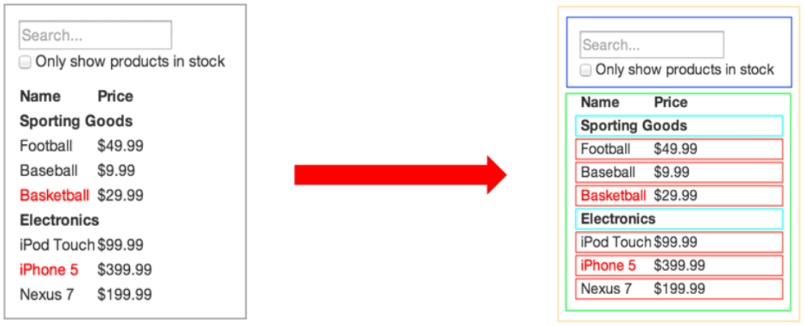
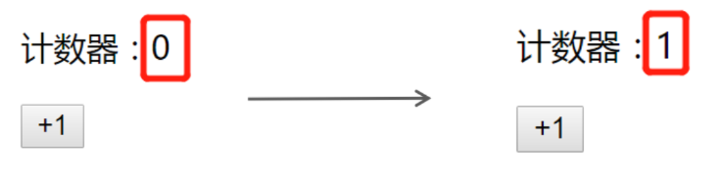

# 组件基础

## 内容介绍

+ [ ] React 组件介绍
+ [ ] React 组件的两种创建方式
+ [ ] 事件绑定
+ [ ] 组件的状态
+ [ ] 事件绑定 this 指向
+ [ ] 表单处理

## 组件基本介绍                                                                                                                                                                                                                                                                                                                                                                                                                                

**目标**：能够知道 React 组件的意义

**内容**：

+ 组件是 React 开发（现代前端开发）中最重要的内容
+ 组件允许你将 UI 拆分为独立、可复用的部分，每个部分都可以独立的思考
+ 组合多个组件（组装乐高积木）实现完整的页面功能
+ 特点：独立、可复用、可组合
+ 组件包含三部分：HTML/CSS/JS
+ 展示页面中的可复用部分



## React创建组件-函数组件

**目标：**掌握react中使用函数创建组件

**内容**：

+ 函数组件：使用JS的函数或者箭头函数创建的组件
  + 使用 JS 的函数(或箭头函数)创建的组件，叫做`函数组件`	
  + 约定1：**函数名称必须以大写字母开头**，React 据此区分组件和普通的 HTML标签
  + 约定2：**函数组件必须有返回值**，表示该组件的 UI 结构；如果不需要渲染任何内容，则返回 `null`

+ 使用函数创建组件

```jsx
// 使用普通函数创建组件：
function Hello() {
  return <div>这是我的第一个函数组件!</div>
}
function Button() {
  return <button>按钮</button>
}

// 使用箭头函数创建组件：
const Hello = () => <div>这是我的第一个函数组件!</div>
```

+ 使用组件
  + 组件就像 HTML 标签一样可以被渲染到页面中。组件表示的是一段结构内容，对于函数组件来说，渲染的内容是函数返回值对应的内容
  + 使用函数名称作为组件标签名称

```jsx
// 使用 双标签 渲染组件：
<Hello></Hello>
ReactDOM.render(<Hello></Hello>, root)

// 使用 单标签 渲染组件：
<Hello />
ReactDOM.render(<Hello />, root)
```

**小结**：

1. 在react中可以使用函数或者箭头函数创建组件
2. 组件的首字母必须大写

## React创建组件-类组件

**目标**：使用ES6的class语法创建组件

**内容**

- 使用 ES6 的 class 创建的组件，叫做类（class）组件
- 约定1：**类名称也必须以大写字母开头**
- 约定2：类组件应该继承 React.Component 父类，从而使用父类中提供的方法或属性 
- 约定3：类组件必须提供 render 方法
- 约定4：render 方法必须有返回值，表示该组件的 UI 结构

**核心代码**

定义组件

```jsx
// 导入 React
import React from 'react'
class Hello extends React.Component {
  render() {
    return <div>Hello Class Component!</div> 
  }
}
ReactDOM.render(<Hello />, root)

// 只导入 Component
import { Component } from 'react'
class Hello extends Component {
  render() {
    return <div>Hello Class Component!</div> 
  }
}
```

使用组件

```jsx
ReactDOM.render(<Hello />, root)
```

**总结**

1. 使用class语法创建组件比函数创建稍微麻烦一些，但是类组件的功能会比函数组件的功能更加强大（*hooks 之前*）

## 将组件提取到单独的js文件中

**目标**：能够将react组件提取到独立的js文件中

**内容**：

思考：项目中的组件多了之后，该如何组织这些组件呢？

+ 选择一：将所有组件放在同一个JS文件中
+ 选择二：将每个组件放到单独的JS文件中
+ 组件作为一个独立的个体，一般都会放到一个单独的 JS 文件中

实现方式

1. 创建 Hello.js
3. 创建组件（函数 或 类）
4. 在 Hello.js 中导出该组件
5. 在 index.js 中导入 Hello 组件
6. 渲染组件

**核心代码**

```jsx
// index.js
import Hello from './Hello'
// 渲染导入的Hello组件
ReactDOM.render(<Hello />, root)


// Hello.js
import { Component } from 'react'
class Hello extends Component {
  render() {
    return <div>Hello Class Component!</div>
  }
}
// 导出Hello组件
export default Hello
```

## 有状态组件和无状态组件

**目标**：理解函数组件和类组件的区别

**内容**：

+ 函数组件又叫做*无状态组件*   函数组件是不能自己提供数据【前提：不考虑 hooks 的情况下】
+ 类组件又叫做*有状态组件*  类组件可以自己提供数据
+ **状态（state）**是组件的*私有*数据，当组件的状态发生了改变，页面结构也就发生了改变（**数据驱动视图**）
+ **函数组件是没有状态的，只负责页面的展示**（`静`态，不会发生变化），性能比较高
+ **类组件有自己的状态，负责*更新UI*，只要类组件的数据发生了改变，UI 就会发生更新**（`动`态）
+ 在项目中，一般都是由函数组件和类组件共同配合来完成的

比如计数器案例，点击按钮让数值+1， 0和1就是不同时刻的状态，当状态从0变成1之后，UI也要跟着发生变化。React想要实现这种功能，就需要使用有状态组件来完成。



函数组件和类组件的区别：有没有状态【前提：不考虑 hooks 的情况下】

## 类组件的状态

**目标**：掌握react类组件中如何提供状态以及渲染状态

**内容**：

+ 状态`state`，即数据，是组件内部的**私有数据**，只能在组件内部使用
+ 状态 state 的值是**对象**，表示一个组件中可以有多个数据
+ 通过 `this.state.xxx` 来获取状态

**核心代码**

+ 创建 state

```jsx
class Hello extends Component {
  // 为组件提供状态
  state = {
    count: 0,
    list: [],
    isLoading: true
  }

  render() {
    return (
      <div>计数器</div>
    )
  }
}
```

+ 读取状态：通过 `this.state` 来获取状态

```jsx
class Hello extends Component {
  // ...
  render() {
    // 通过 this.state 来访问类组件的状态
    return (
      <div>计数器：{this.state.count}</div>
    )
  }
}
```

## react插件的安装

**目标**：安装 Chrome 浏览器插件`react-devtools`

**内容**：安装后，只会在使用了 React 的网站中出现

## 事件处理-注册事件

**目标：**掌握react中如何注册事件

**内容**：

- React注册事件与DOM的事件语法非常像

- 语法`on+事件名 =｛事件处理程序｝` 比如`onClick={this.handleClick}`

- 注意：*React事件采用驼峰命名法*，比如`onMouseEnter`, `onClick`

**核心代码**

```jsx
class App extends React.Component {
  handleClick() {
    console.log('点击事件触发')
  }
  
  render() {
    return (
      <div>
        <button onClick={this.handleClick}>点我</button>
      </div>
    )
  }
}
```

## 事件处理-事件对象

**目标**：掌握注册事件时如何处理事件对象

**核心代码**

+ 可以通过事件处理程序的参数获取到事件对象
+ 注意：React 中的事件对象是 React 内部处理后的事件对象，一般称为：SyntheticBaseEvent 合成事件对象。用法与 DOM 原生的事件对象用法基本一致


```jsx
function handleClick(e) {
  e.preventDefault()
  console.log('事件对象', e)
}

<a onClick={this.handleClick}>点我，不会跳转页面</a>
```

## 事件处理-this指向问题

**目标**：了解事件处理程序中this指向undefined且知道原因

**内容：**

+ 事件处理程序中的this指向的是`undefined`

+ render方法中的this指向的是当前react组件。**只有事件处理程序中的this有问题**
+ 原因
  + 事件处理程序的函数式函数调用模式，在严格模式下，this指向`undefined`
  + render函数是被组件实例调用的，因此render函数中的this指向当前组件

```js
class App extends React.Component {
  state = {
    msg: 'hello react'
  }
  handleClick() {
    console.log(this.state.msg)
  }
  render() {
    return (
      <div>
        <button onClick={this.handleClick}>点我</button>
      </div>
    )
  }
}
```

**总结**：

1. 在react的事件处理函数中，this指向`undefined`

## 事件处理-this指向解决方案

**目标：**掌握常见的this指向解决方案

**内容**：

+ 解决事件处理程序中this指向问题主要有三种方式

+ 方式1：箭头函数

```jsx
class App extends React.Component {
  state = {
    msg: 'hello react'
  }
  handleClick() {
    console.log(this.state.msg)
  }
  render() {
    return (
      <div>
        <button onClick={() => this.handleClick()}>点我</button>
      </div>
    )
  }
}
```

+ 方式2：`bind`

```jsx
class App extends React.Component {
  state = {
    msg: 'hello react'
  }
  handleClick() {
    console.log(this.state.msg)
  }
  render() {
    return (
      <div>
        <button onClick={this.handleClick.bind(this)}>点我</button>
      </div>
    )
  }
}
```

+ 方式3：箭头函数形式的实例方法 - **推荐使用**

```jsx
class App extends React.Component {
  state = {
    msg: 'hello react'
  }

  handleClick = () => {
    console.log(this.state.msg)
  }
  render() {
    return (
      <div>
        <button onClick={this.handleClick}>点我</button>
      </div>
    )
  }
}
```

**总结**

1. 推荐使用方式3，箭头函数形式的实例方法

- 解释为什么方式3可以解决 this 指向问题：

```js
// ES6
class Person1 {
  // 类的 构造函数
  constructor() {
    // 构造函数中的 this 就是实例对象
    console.log(this)
    this.name = 'jack'
    this.fn = () => {
      console.log(this)
    }
  }

  // 上述写法简化语法：
  // name = 'jack'
  // fn = () => {}

  // 这个形式的方法会被添加到原型中
  sayHi() {}
}

说明：

fn = () => {}  这种形式的语法是简化语法（语法糖），书写会更简单。实际上，完整的写法是：

constructor() {
  this.fn = () => {}
}

即：在构造函数中，给 this 添加了一个方法 fn

为什么可以解决 this 指向问题呢？
因为 constructor 中创建的箭头函数，内部的 this 会指向 constructor 中的 this
而 constructor 中的 this 就是实例对象（也就是我们需要的 this）
```

## setState 修改状态

**目标：**掌握react中如何通过setState修改状态

**内容**：

- 语法：`this.setState({ 要修改的部分数据 })`
- setState() 作用：1 **修改 state** 2 **更新 UI**
- 思想：**数据驱动视图**，也就是只需要修改数据（状态）那么页面（视图）就会自动刷新
  - 核心：数据！！！
  - 从现在开始，我们关心的是如何修改数据，而不再是关心如何修改DOM
  - 并且，注意：尽量避免直接手动 DOM（通过 document.querySelector() 获取到到DOM对象然后再操作） 操作！！！
- 注意：*不要直接修改 state 中的值，这是无效的*！

**核心代码**

```jsx
class Hello extends Component {
  state = {
    count: 0
  }

	handleClick = () => {
    this.setState({
      count: 10
    })
  }  

  render() {
    return (
      <div>
        <h1>计数器：{this.state.count}</h1>
        <button onClick={this.handleClick}>+1</button>
      </div>
    )
  }
}

// 在 count 当前值的基础上加 1
this.setState({
  count: this.state.count + 10
})
```

**总结**：

1. 能直接修改 state 的值吗？不能
2. 如何修改 React 组件中的状态？`setState()`
3. setState 是哪来的？从 Component 父类继承过来的

## react核心理念-状态不可变

**目标：**理解react核心理念-状态不可变

**内容：**

- 状态不可变指的是：不要直接修改状态的值，而是基于当前状态创建新的状态值

**核心代码**：


```js
state = {
  count: 0,
  list: [1, 2, 3],
  person: {
    name: 'jack',
    age: 18
  }
}

// 【不推荐】直接修改当前值的操作：
this.state.count++
++this.state.count
this.state.count += 1
this.state.count = 1

// 只要是数组中直接修改当前数组的方法都不能用！
this.state.list.push(123)

this.state.person.name = 'rose'

// 【推荐】不是直接修改当前值，而是创建新值的操作：
this.setState({
  count: this.state.count + 1,
  list: [...this.state.list, 123],
  person: {
    ...this.state.person,
    // 要修改的属性，会覆盖原来的属性，这样，就可以达到修改对象中属性的目的了
    name: 'rose'
  }
})
```

## 表单处理-受控组件

**目标：**能够使用受控组件的方式获取文本框的值

**内容**：

+ HTML中表单元素是可输入的，即表单元素维护着自己的可变状态（value）
+ 但是在react中，可变状态通常是保存在`state`中的，并且要求状态只能通过`setState`进行修改
+ React中将state中的数据与表单元素的value值绑定到了一起，**由state的值来控制表单元素的值**
+ 受控组件：**value值受到了react状态控制的表单元素** 

**核心代码：**

```jsx
class App extends React.Component {
  state = {
    msg: 'hello react'
  }

  handleChange = (e) => {
    this.setState({
      msg: e.target.value
    })
  }

  render() {
    return (
      <div>
        <input type="text" value={this.state.msg} onChange={this.handleChange}/>
      </div>
    )
  }
}
```

**总结**：

1. 使用受控组件的方式处理表单元素后，状态的值就是表单元素的值。即：想要操作表单元素的值，只需要操作对应的状态即可*

## 表单处理-非受控组件-ref

**目标：**非受控组件借助于ref，使用原生DOM的方式来获取表单元素的值

**内容**

- 受控组件是通过 React 组件的状态来控制表单元素的值
- 非受控组件是通过**手动操作 DOM 的**方式来控制
- 此时，需要用到一个新的概念：`ref`
- ref：用来在 React 中获取 DOM 元素

**核心代码**

```jsx
// 1 导入 createRef 函数（ 用来创建 ref 对象 ）
import { createRef } from 'react'

class Hello extends Component {
  // 2 调用 createRef 函数来创建一个 ref 对象
  //   ref 对象的名称（txtRef）可以是任意值
  //   命名要规范： txt（DOM 元素的自己标识） + Ref
  txtRef = createRef()

  handleClick = () => {
    // 文本框对应的 DOM 元素
    // console.log(this.txtRef.current)

    // 4 获取文本框的值：
    console.log(this.txtRef.current.value)
  }

  render() {
    return (
      <div>
        {/*
        	3 将创建好的 ref 对象，设置为 input 标签的 ref 属性值
        		作用：将 ref 和 input DOM 绑定到一起，将来在通过 this.txtRef 拿到的就是当前 DOM 对象
        */}
        <input ref={this.txtRef} />
        <button onClick={this.handleClick}>获取文本框的值</button>
      </div>
    )
  }
}
```

## 综合案例-B站评论列表

### tab栏切换功能

**目标：**完成评论列表中的tab栏切换功能

**步骤：**

1. 给tab栏注册点击事件
2. 修改active进行切换

**核心代码：**

+ 给tab栏注册点击事件

```jsx
<li
  className={item.type === this.state.active ? 'on' : ''}
  key={item.id}
  onClick={() => this.changeTab(item.type)}
>
  按{item.name}排序
</li>
```

+ 修改active属性

```jsx
changeTab = (type) => {
  this.setState({
    active: type,
  })
}
```

### 删除评论功能

**目标：完成评论列表案例的删除功能**

**步骤：**

1. 给删除按钮注册点击事件
2. 通过setState删除对应的数据

**核心代码**：

+ 给删除按钮注册点击事件

```jsx
<span
  className="reply btn-hover"
  onClick={() => this.del(item.id)}
>
  删除
</span>
```

+ 通过setState删除对应的数据

```jsx
del = (id) => {
  this.setState({
    list: this.state.list.filter((item) => item.id !== id)
  })
}
```

### 添加评论功能

**目标：**完成评论列表添加功能

**步骤：**

1. 通过受控组件的方式获取到评论内容
2. 通过setState添加评论
3. 重置评论的内容

**核心代码**

+ 受控组件方式获取内容

```jsx
state = {
  // ...
  content: ''
}

<textarea
  cols="80"
  rows="5"
  placeholder="发条友善的评论"
  className="ipt-txt"
  value={this.state.content}
  onChange={this.handleChange}
/>

handleChange = (e) => {
  this.setState({
    content: e.target.value,
  })
}
```

+ 点击按钮添加评论

```jsx
<button className="comment-submit" onClick={this.add}>
  发表评论
</button>

add = () => {
  const newComment = {
    id: Date.now(),
    author: '作者',
    comment: this.state.content,
    time: new Date(),
    // 1: 点赞 0：无态度 -1:踩
    attitude: 0,
  }
  this.setState({
    list: [newComment, ...this.state.list],
    content: '',
  })
}
```

### 点赞与踩的功能

**目标：**完成点赞与踩的功能

**步骤：**

1. 注册点击事件
2. 修改点赞状态

**核心代码**

+ 注册点击事件

```jsx
<span
  onClick={() =>
    this.changeAttitude(
      item.id,
      item.attitude === 1 ? 0 : 1
    )
  }
  className={[
    'like',
    item.attitude === 1 ? 'liked' : '',
  ].join(' ')}
>
  <i className="icon" />
</span>
<span
  onClick={() =>
    this.changeAttitude(
      item.id,
      item.attitude === -1 ? 0 : -1
    )
  }
  className={[
    'hate',
    item.attitude === -1 ? 'hated' : '',
  ].join(' ')}
>
  <i className="icon" />
</span>
```

+ 修改点赞状态

```jsx
changeAttitude = (id, attitude) => {
  this.setState({
    list: this.state.list.map((item) => {
      if (item.id === id) {
        return {
          ...item,
          attitude,
        }
      } else {
        return item
      }
    }),
  })
}
```

### 点击 tabs 切换时排序

推荐使用 `lodash` 工具库来实现排序功能

步骤：

- [lodasht/sortBy](https://www.lodashjs.com/docs/lodash.orderBy)

1. 安装：`yarn add lodash`
2. 单独导入 `orderBy` 函数
3. 调用 `orderBy` 实现排序

## 补充：

`lodash` 的说明：

```js
// 完整导入：导入所有的工具函数
import _ from 'lodash'

// 使用：
_.sortBy(...)
         
// 按需导入：用到哪个工具函数就导入哪个
import sortBy from 'lodash/sortBy'
sortBy(...)
```

- 前身：[underscore.js](https://underscorejs.net/)
