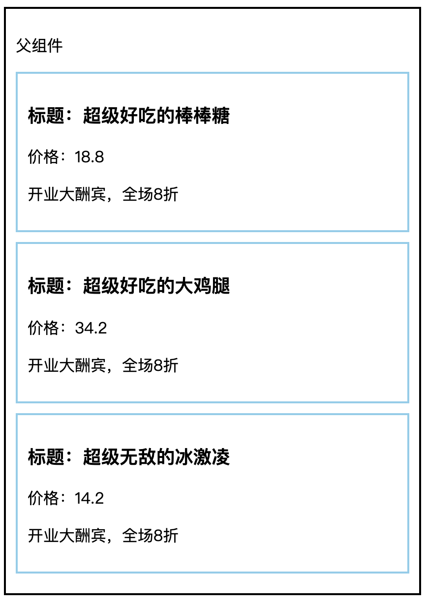

# 组件通讯

+ [ ] 组件通讯介绍以及为什么要有组件通讯
+ [ ] 组件的props
+ [ ] 组件通讯的三种方式 父传子  子传父  兄弟组件
+ [ ] Context组件通讯

## 组件通讯介绍

**目标**：了解为什么需要组件通讯

**内容：**

+ 组件是*独立且封闭*的单元，默认情况下，只能使用组件自己的数据
+ 在组件化过程中，通常会将一个完整的功能拆分成多个组件，以更好的完成整个应用的功能
+ 而在这个过程中，多个组件之间不可避免的要共享某些数据
+ 为了实现这些功能，就需要**打破组件的独立封闭性**，让其与外界沟通。这个过程就是**组件通讯**。

**总结**

1. *组件中的状态是私有的*，也就是说，组件的状态只能在组件内部使用，无法直接在组件外使用

## props基本使用

**目标：**能够使用组件的props实现传递数据和接收数据

**内容：**

- 使用场景：组件接收外部数据时
- 作用：接收（其他组件）传递给当前组件的数据
- 如何传递？给组件标签添加属性，就表示给组件传递数据
- 如何接收？函数组件通过参数 `props` 接收数据，类组件通过 `this.props` 

**核心代码：**

+ 函数组件获取props

```jsx
// 接收数据：
// props 的值就是：{ name: 'jack', age: 19 }
function Hello(props) {
  return (
    <div>接收到数据:{props.name}</div>
  )
}

// 传递数据：
// 可以把传递数据理解为调用函数 Hello，即：Hello({ name: 'jack', age: 19 })
<Hello name="jack" age={19} />
<div id="" name=""></div>
```
+ 类组件获取props

```jsx
// 接收数据：
// class 组件需要通过 this.props 来获取
// 注意：this.porps 属性名是固定的！！！
class Hello extends Component {
  render() {
    return (
      <div>接收到的数据:{this.props.age}</div>
    ) 
  }
}

// 传递数据：
<Hello name='jack' age={19} />
```

**总结：**

+ props是实现组件通讯的关键，在实现组件通讯之前，需要先掌握props的使用

## props的注意点

**目标：** 了解props的特点，知道什么是单向数据流

**内容：**

+ **props 是只读对象**，也就是说：只能读取对象中的属性，无法修改
  + **单向数据流**，也叫做：自顶而下（自上而下）的数据流
  + 表示：父组件中的数据可以通过 props 传递给子组件，并且，当父组件中的数据更新时，子组件就会自动接收到最新的数据
  + 类比：就像瀑布的水一样只能从上往下流动，并且，当上游的水变浑浊，下游的水也会受到影响
+ 可以传递任意数据（数字  字符串  布尔类型 数组 对象 函数 jsx）

## 组件通讯-父传子

**目标**：将父组件的数据传递给子组件

**步骤**：

1. 父组件提供要传递的state数据

2. 给子组件标签添加属性，值为 state 中的数据

3. 子组件中通过 props 接收父组件中传递的数据

**核心代码**

父组件提供数据并且传递给子组件

```jsx
class Parent extends React.Component {
  state = {
    money: 10000
  }
  render() {
    const { money } = this.state
    return (
      <div>
        <h1>我是父组件：{money}</h1>
        {/* 将数据传递给子组件 */}
        <Child money={money} />
      </div>
    )
  }
}
```

子组件接收数据

```jsx
function Child(props) {
	return (
  	<div>
      {/* 接收父组件中传递过来的数据 */}
    	<h3>我是子组件 -- {props.money}</h3>
    </div>
  )
}
```

## 组件通讯-父传子练习

**目标：**能够通过父到子组件通讯实现该案例效果



**核心代码**

+ 数据

```js
// 列表数据
[
  { id: 1, name: '超级好吃的棒棒糖', price: 18.8, info: '开业大酬宾，全场8折' },
  { id: 2, name: '超级好吃的大鸡腿', price: 34.2, info: '开业大酬宾，全场8折' },
  { id: 3, name: '超级无敌的冰激凌', price: 14.2, info: '开业大酬宾，全场8折' }
]
```
+ 结构

```jsx
<div className="parent">
	<h1>父组件</h1>
  
  <div className="child">
    <div className="product">
      <h3>标题：</h3>
      <div>价格：</div>
      <div>开业大酬宾</div>
    </div>
  </div>
</div>
```

+ 样式

```css
/* 基础样式 */
.parent {
  width: 80%;
  padding: 10px;
  border: 2px solid black;
}
.child {
  margin: 10px 0;
  padding: 10px;
  border: 2px solid skyblue;
}
.product {
  padding: 20px;
  border: 2px solid #000;
  border-radius: 5px;
  margin: 10px;
}

```

## 组件通讯-子传父

**目标：**能够将子组件的数据传递给父组件

**内容**：

思路：利用回调函数来实现，父组件提供回调，子组件调用回调，将要传递的数据作为回调函数的参数

**步骤**：

1. 父组件提供一个回调函数（用于接收数据）
2. 将该函数作为属性的值，传递给子组件
3. 子组件通过 props 调用回调函数
4. 将子组件的数据作为参数传递给回调函数

**核心代码**：

父组件提供函数并且传递给子组件

```jsx
class Parent extends React.Component {
  state = {
    money: 10000
  }
	// 回调函数
	buyPhone = price => {
    this.setState({
      money: this.state.money - price
    })
  }
  render() {
    const { money } = this.state
    return (
      <div>
        <h1>我是父组件：{money}</h1>
        {/* 传递给子组件 */}
        <Child money={money} buyPhone={this.buyPhone} />
      </div>
    )
  }
}
```

子组件接收函数并且调用

```jsx
const Child = (props) => {
  const handleClick = () => {
    // 子组件调用父组件传递过来的回调函数
		props.buyPhone(100)
  }
  return (
    <div>
      <h3>我是子组件 -- {props.money}</h3>
      <button onClick={handleClick}>买手机</button>
    </div>
  )
}
```

**总结**：

1. 父组件如何接收子组件传递过来的数据？ 回调函数的参数
2. 子组件如何传递数据给父组件？ 调用回调时传入的参数
3. 父组件状态更新后，子组件拿到的数据是否自动更新了？ 会自动更新，这是 单向数据流 的体现

## 组件通讯-子传父练习

**目标：**能够使用子到父通讯实现案例中的砍价功能


## 组件通讯-兄弟组件

**目标：**能够理解什么是状态提升，并实现兄弟组件之间的组件通讯

**内容**：

+ 思想：**状态提升**

+ 解释：将共享状态提升到最近的公共父组件中，由公共父组件管理这个状态

+ 公共父组件职责：
  1. 提供共享状态 

  2. 提供操作共享状态的方法

+ 要通讯的子组件只需通过 props 接收状态或操作状态的方法

状态提升前


状态提升之后


**核心代码**

+ `index.js`

```jsx
import React, { Component } from 'react'
import ReactDOM from 'react-dom'

// 导入两个子组件
import Jack from './Jack'
import Rose from './Rose'

// App 是父组件
class App extends Component {
  // 1. 状态提升到父组件
  state = {
    msg: '',
  }

  changeMsg = msg => {
    this.setState({
      msg,
    })
  }
  
  render() {
    return (
      <div>
        <h1>我是App组件</h1>
        {/* 兄弟组件 1 */}
        <Jack say={this.changeMsg}></Jack>
				{/* 兄弟组件 2 */}
        <Rose msg={this.state.msg}></Rose>
      </div>
    )
  }
}

// 渲染组件
ReactDOM.render(<App />, document.getElementById('root'))
```

+ `Jack.js`

```jsx
import React, { Component } from 'react'

export default class Jack extends Component {
  say = () => {
    // 修改数据
    this.props.say('you jump i look')
  }
  render() {
    return (
      <div>
        <h3>我是Jack组件</h3>
        <button onClick={this.say}>说</button>
      </div>
    )
  }
}
```

+ `Rose.js`

```jsx
import React, { Component } from 'react'

export default class Rose extends Component {
  render() {
    return (
      <div>
        {/* 展示数据 */}
        <h3>我是Rose组件-{this.props.msg}</h3>
      </div>
    )
  }
}
```

## 组件通讯 - Context

**目标：**通过context实现跨级组件通讯

**内容**  

+ 组件之间的层级关系，除了以上两种常见的情况外，还有一种不太常见的情况，那就是：远房亲戚关系（也就是两个组件之间间隔较远） 

  
  

+ 实现方式：使用 Context 来实现跨组件传递数据

+ Context 上下文，可以理解一个范围，只要在这个范围内容，就可以直接夸组件传递数据

**核心代码**

```jsx
// 0 导入创建 context 的函数
import { createContext } from 'react'

// 1 创建 Context 对象
//	 createContext 的返回值是一个 对象
//	 对象中包含了两个组件，分别是： Provider 状态的提供者组件（提供状态）  Consumer 状态的消费者组件（使用状态）
const { Provider, Consumer } = createContext()

// 2 使用 Provider 组件包裹整个应用，并通过 value 属性提供要共享的数据
<Provider value="blue">
  <div className="App">
    <Node /> 
  </div>
</Provider>

// 3 使用 Consumer 组件接收要共享的数据
<Consumer>
  {color => <span>data参数表示接收到的数据 -- {color}</span>}
</Consumer>
```

## 综合案例：B站评论列表

### 1. 组件拆分

1. 创建 components 目录，将以下子组件都放到该目录中
2. 拆分组件`Tabs.js` - tab 栏
3. 拆分组件`Form.js` - 评论表单
4. 拆分组件`CommentList.js` - 评论列表

### 2. 准备状态

分析说明：因为以上 3 个子组件中，都可能会用到 list 等状态数据，所以，应该将状态提升到父组件中
也就是：**在父组件中提供状态**

### 3. tab栏切换功能

**目标**：能够渲染 tabs 并完成切换功能

**步骤**：

1. 将 tabs 数据传递给 Tabs 子组件
2. 在 Tabs 子组件中，通过 props 接收到 tabs 数据
3. 渲染tab栏
4. 父组件中提供切换 tab 的方法
5. 将切换 tab 的方法，传递给子组件
6. 在子组件中拿到父组件传递过来的切换 tab 的方法
7. 点击 tab 时，调用该方法，并将当前 tab 的类型传递给父组件

**核心代码**：

App.js 中：

```jsx
// 切换 tabs
changeActive = active => {
  const { list } = this.state
  let newList
  if (active === 'hot') {
    // 热度
    newList = orderBy(list, ['id'], ['asc'])
  } else {
    // 时间
    newList = orderBy(list, ['time'], ['desc'])
  }

  this.setState({
    active,
    list: newList
  })
}

<Tabs tabs={tabs} active={active} changeTab={this.changeTab}></Tabs>
```

components/Tabs.js 中：

```jsx
import { Component } from 'react'

const Tabs = ({ tabs, active, changeTab }) => {
  return (
    <div className="tabs-order">
      <ul className="sort-container">
        {tabs.map((item) => (
          <li
            key={item.id}
            className={item.type === active ? 'on' : ''}
            onClick={() => changeTab(item.type)}
            >
            按{item.name}排序
          </li>
        ))}
      </ul>
    </div>
  )
}

export default Tabs
```

### 4. 展示评论列表

**目标**：能够在子组件中展示评论列表数据

**步骤**：

1. 将 list 数据传递给 CommentList 子组件
2. 在 CommentList 子组件中，接收到 list 数据
3. 渲染评论列表数据

**核心代码**：

App.js 中：

```jsx
<CommentList list={list} />
```

components/CommentList.js 中：

```jsx
import { Component } from 'react'
import moment from 'moment'
import classNames from 'classnames'
import avatar from '../images/avatar.png'

const CommentList ({ list }) => {
	const fomartTime = time => {
    return moment(time).format('YYYY-MM-DD HH:mm:ss')
  }
  
  return (
    <div className="comment-list">
      {list.map(item => (
        <div key={item.id} className="list-item">
          <div className="user-face">
            
          </div>
          <div className="comment">
            <div className="user">{item.author}</div>
            <p className="text">{item.comment}</p>
            <div className="info">
              <span className="time">{fomartTime(item.time)}</span>
              {/* 赞 */}
              <span
                className={
                  classNames('like', {
                    liked: item.attitude === 1
                  })
                }
              >
                <i className="icon" />
              </span>
              {/* 踩 */}
              <span
                className={
                  classNames('hate', {
                    hated: item.attitude === -1
                  })
                }
              >
                <i className="icon" />
              </span>
              <span className="reply btn-hover">
                删除
              </span>
            </div>
          </div>
        </div>
      ))}
    </div>
  )
}

```

### 5. 删除评论

**目标**：能够通过子到父的组件通讯完成删除评论功能

**步骤**：

1. 父组件提供删除评论的方法
2. 将删除评论的方法传递给子组件
3. 子组件在删除按钮的点击事件中，通过 props 拿到父组件传递过来的方法
4. 调用删除评论的方法，并将评论项 id 作为参数传递给父组件

**核心代码**：

App.js 父组件中：

```jsx
// 删除评论
delComment = id => {
  const newList = this.state.list.filter(item => item.id !== id)
  this.setState({
    list: newList
  })
}

{/* 评论列表 */}
<CommentList delComment={this.delComment} />
```

components/CommentList.js 中：

```jsx
render() {  
  return (
  	// ...
    <span
      className="reply btn-hover"
      onClick={() => this.props.delComment(item.id)}
    >
      删除
    </span>
  )
}
```

### 6. 点赞与踩

**目标**：能够通过子到父的组件通讯完成点赞功能

**步骤**：

1. 父组件提供点赞和踩的方法
2. 将该方法传递给子组件
3. 子组件在点赞或踩的点击事件中，通过 props 拿到父组件传递过来的方法
4. 调用点赞或踩的方法，将当前项 id 和 目标 attitude 递给父组件

**核心代码**：

App.js 父组件中：

```jsx
// 点赞或踩
changeAttitude = (id, attitude) => {
  const newList = this.state.list.map(item => {
    if (item.id === id) {
      return {
        ...item,
        attitude
      }
    }
    return item
  })
  this.setState({
    list: newList
  })
}

<CommentList changeAttitude={this.changeAttitude} />
```

components/CommentList.js 中：

```jsx
render() {
  return (
    // ...
    {/* 赞 */}
    <span
      onClick={() =>
        this.props.changeAttitude(
          item.id,
          item.attitude === 1 ? 0 : 1
        )
      }
    >
      <i className="icon" />
    </span>
    {/* 踩 */}
    <span
      onClick={() =>
        this.props.changeAttitude(
          item.id,
          item.attitude === -1 ? 0 : -1
        )
      }
    >
      <i className="icon" />
    </span>
  )
}
```

### 7. 添加评论

**目标**：能够通过子到父通讯实现添加评论功能

**步骤**：

1. 父组件提供添加评论的方法
2. 将该方法传递给子组件
3. 子组件在添加评论按钮的点击事件中，通过 props 拿到父组件传递过来的方法
4. 调用添加评论的方法，将当前项评论内容传递给父组件

**核心代码**：

App.js 父组件中：

```jsx
// 添加评论
addComment = text => {
  const { list } = this.state

  // 处理 id
	const id = Math.max(...list.map(item => item.id)) + 1

  // 创建新的状态
  const newList = [
    {
      id,
      author: '89 吴彦祖',
      comment: txt,
      time: new Date(),
      attitude: 0
    },
    ...list
  ]

  this.setState({
    list: newList,
    // 清空文本框的值
    txt: ''
  })
}

<Form addComment={this.addComment} />
```

components/Form.js 中：

```jsx
import { Component } from 'react'
import { createRef } from 'react'
import avatar from './images/avatar.png'

class Form extends Component {
  state = {
    txt: ''
  }

  // 创建 ref 对象
  txtRef = createRef()

  // 控制文本域的值
  changeTxt = e => {
    this.setState({
      txt: e.target.value
    })
  }
  
  onAdd = () => {
    const { txt } = this.state
    if (txt.trim() === '') {
      return this.txtRef.current.focus()
    }
	
    // 调用父组件的方法
    this.props.addComment(txt)
  }
  
  render() {
    return (
    	<div className="comment-send">
        <div className="user-face">
          
        </div>
        <div className="textarea-container">
          <textarea
            cols="80"
            rows="5"
            placeholder="发条友善的评论"
            className="ipt-txt"
            value={txt}
            onChange={this.changeTxt}
            ref={this.txtRef}
            />
          <button className="comment-submit" onClick={this.onAdd}>
            发表评论
          </button>
        </div>
        <div className="comment-emoji">
          <i className="face"></i>
          <span className="text">表情</span>
        </div>
      </div>
    )
  }
}
```

