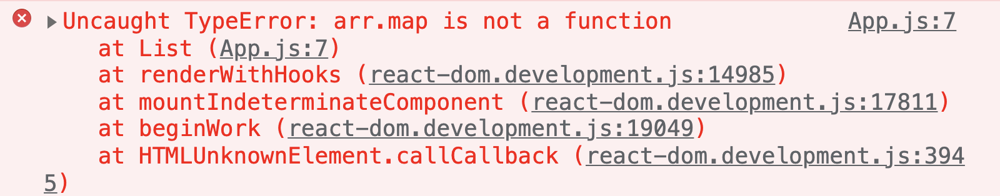
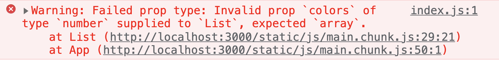
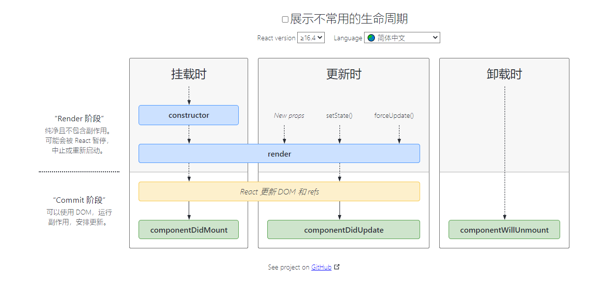

# React组件进阶

+ [ ] children属性
+ [ ] props校验
+ [ ] props默认值
+ [ ] 生命周期与钩子函数

## children 属性

**目标：**掌握props中children属性的用法

**内容**：

+ children 属性：表示该组件的子节点，只要组件有子节点，props就有该属性

+ children 属性与普通的 props 一样，值可以是任意值（文本、React元素、组件，甚至是函数）

**核心代码**

```jsx
const Hello = props => {
  return (
    <div>
      该组件的子节点：{props.children}
    </div>
  )
}

<Hello>我是子节点</Hello>
```

练习：实现标题栏组件

App.js 中：

```jsx
const NavBar = props => {
  return (
    <div className="nav-bar">
      <span>&lt;</span>
      <div className="title">{props.children}</div>
    </div>
  )
}

export default class App extends Component {
  render() {
    return (
      <div>
        <NavBar>标题</NavBar>
        <br />
        <NavBar>商品</NavBar>
        <br />
        <NavBar>
          <span style={{ color: 'red' }}>花哨的标题</span>
        </NavBar>
      </div>
    )
  }
}
```

App.css 中：

```css
.nav-bar {
  display: flex;
  position: relative;
  background-color: #9696dc;
  padding: 5px;
  text-align: center;
}

.title {
  position: absolute;
  width: 100%;
  height: 100%;
}
```

## props 校验  

**目标：**校验接收的props的数据类型，增加组件的健壮性

**内容：**

[props 校验文档](https://reactjs.org/docs/typechecking-with-proptypes.html)

对于组件来说，props 是外来的，无法保证组件使用者传入什么格式的数据 

如果传入的数据格式不对，可能会导致组件内部报错，关键是：**组件的使用者不能很明确的知道错误的原因**

比如，以下的示例代码会报错，并且无法根据错误，准确的定位出现问题的原因：

```jsx
// 假设，这是 小明 创建的 List 组件
const List = props => {
  const arr = props.colors
  const lis = arr.map((item, index) => <li key={index}>{item.name}</li>)
	return (
		<ul>{lis}</ul>
	)
}

// 小红使用小明创建的 List 组件
<List colors={19} />
```

错误信息如下：



如何解决？ **props 校验**

**props校验**：允许在创建组件的时候，就约定props的格式、类型等

```jsx
// 约定 List 组件的 colors 属性是数组类型
// 如果不是数组就会报错，增加组件的健壮性
List.propsTypes = {
  colors: PropTypes.array
}
```

此时，代码同样会报错，但是，我们可以拿到更加明确的错误提示：



**步骤**：

1. 安装属性校验的包：`yarn add prop-types`
2. 导入 `prop-types` 包 
3. 使用`组件名.propTypes = {}` 来给组件 List 的props添加校验规则
4. 为组件添加 `propTypes` 属性，并通过 `PropTypes` 对象来指定属性的类型

**核心代码**：

```jsx
import PropTypes from 'prop-types'

const List = props => {
  const arr = props.colors
  const lis = arr.map((item, index) => <li key={index}>{item.name}</li>)
  return <ul>{lis}</ul>
}

List.propTypes = {
  colors: PropTypes.array
}
```

## props校验-规则

**目标：**了解react组件props校验的常见规则 

**内容：**

1. 常见类型：array、bool、func、number、object、string
2. React元素类型：element
3. 必填项：isRequired
4. 特定结构的对象：shape({})

**核心代码**

```jsx
// 常见类型
optionalFunc: PropTypes.func,
// 必选
requiredFunc: PropTypes.func.isRequired,
// 特定结构的对象
optionalObjectWithShape: PropTypes.shape({
	color: PropTypes.string,
	fontSize: PropTypes.number
})
```

## props默认值

**目标：**给组件的props提供默认值

**内容：**

- 通过`defaultProps`可以给组件的props设置默认值，在未传入props的时候生效

**核心代码：**

为函数组件添加 props 默认值：

```jsx
function App(props) {
  return (
    <div>
      此处展示props的默认值：{props.pageSize}
    </div>
  )
}
// 设置默认值
App.defaultProps = {
	pageSize: 10
}
// 不传入pageSize属性
<App />
```

为类组件添加 props 默认值：

```jsx
class App extends Component {
  // 方式二：或者使用静态属性：
  static defaultProps = {
    pageSize: 10
  }

  render() {
    return (
      <div>
        此处展示props的默认值：{this.props.pageSize}
      </div>
    )
  }
}
// 方式一：设置默认值
// App.defaultProps = {
//	 pageSize: 10
// }

// 不传入pageSize属性
<App />
```

注意：对于函数组件来说，新版 React 已经不再推荐使用 defaultProps 来添加默认值，而是**推荐使用函数参数的默认值来实现**：

```jsx
// 通过函数参数默认值，来提供 props 默认值
const App = ({ pageSize = 10 }) {
  return (
    <div>
      此处展示props的默认值：{props.pageSize}
    </div>
  )
}

// 不传入pageSize属性
<App />
```

## 类的静态属性-static

**目标：**能够通过类的static语法简化props校验和默认值

**内容：**

+ 实例成员：通过实例对象调用的属性或者方法，叫做实例成员（属性或者方法）
+ 静态成员：通过类或者构造函数本身才能访问的属性或者方法

**核心代码**

```jsx
class Person {
  // 实例属性
  name = 'zs'
	// 实例方法
  sayHi() {
    console.log('哈哈')
  }

  // 静态属性
  static age = 18
	// 静态方法
  static goodBye() {
    console.log('byebye')
  }
}
const p = new Person()

console.log(p.name) 		// 访问实例属性
p.sayHi()								// 调用实例方法

console.log(Person.age)	// 访问静态属性
Person.goodBye()				// 调用静态方法
```

示例：

```jsx
class List extends Component {
  static propTypes = {
    colors: PropTypes.array,
    gender: PropTypes.oneOf(['male', 'female']).isRequired
  }

  static defaultProps = {
		gender: ''
  }
  
  render() {
    const arr = this.props.colors
    const lis = arr.map((item, index) => <li key={index}>{item.name}</li>)
    return <ul>{lis}</ul>
  }
}
```

## 组件生命周期-概述

**目的：**能够理解什么是组件的生命周期以及为什么需要研究组件的生命周期

**内容：**

+ 生命周期：一个事物从创建到最后消亡经历的整个过程
+ 组件的生命周期：组件从被创建到挂载到页面中运行，再到组件不用时卸载的过程

+ 意义：理解组件的生命周期有助于理解组件的运行方式、完成更复杂的组件功能、分析组件错误原因等
+ 钩子函数的作用：为开发人员在不同阶段操作组件提供了时机
+ 注意：**只有 类组件 才有生命周期**


## 组件生命周期-整体说明

**目标：**能够说出组件生命周期总共有几个阶段

**内容：**

+ <http://projects.wojtekmaj.pl/react-lifecycle-methods-diagram/>



## 组件生命周期-挂载阶段

**目标：**能够说出组件的挂载阶段的钩子函数以及执行时机

**内容：**

+ 执行时机：组件创建时（页面加载时）

+ 执行顺序：


| 钩子 函数         | 触发时机                  | 作用                                                         |
| ----------------- | ------------------------- | ------------------------------------------------------------ |
| constructor       | 创建组件时，最先执行      | 1. 初始化state  2. 创建 Ref 3. 使用 bind 解决 this 指向问题等 |
| render            | 每次组件渲染都会触发      | 渲染UI（**注意： 不能调用setState()** ）                     |
| componentDidMount | 组件挂载（完成DOM渲染）后 | 1. 发送网络请求   2.DOM操作                                  |

示例代码：

```jsx
import { Component } from 'react'

export default class App extends Component {
  render() {
    return (
      <div>
        <h1>统计豆豆被打的次数：</h1>
        <button>打豆豆</button>
      </div>
    )
  }
}
```

## 组件生命周期-更新阶段

**目标：**能够说出组件的更新阶段的钩子函数以及执行时机

**内容：**

+ 执行时机：1. setState() 2. forceUpdate() 强制组件更新 3. 组件接收到新的props（实际上，只需要父组件更新，子组件就会重新渲染）
+ 说明：以上三者任意一种变化，组件就会重新渲染
+ 执行顺序


| 钩子函数           | 触发时机                  | 作用                                                         |
| ------------------ | ------------------------- | ------------------------------------------------------------ |
| render             | 每次组件渲染都会触发      | 渲染UI（与 挂载阶段 是同一个render）                         |
| componentDidUpdate | 组件更新（完成DOM渲染）后 | DOM操作，可以获取到更新后的DOM内容，**不要直接调用setState** |

- `componentDidUpdate` 钩子函数的应用，可以参考这个视频：[TabBar菜单高亮Bug分析和修复](https://www.bilibili.com/video/BV14y4y1g7M4?p=119)

## 组件生命周期-卸载阶段

**目标：**能够说出组件的销毁阶段的钩子函数以及执行时机

**内容**：

+ 执行时机：组件从页面中消失  

| 钩子函数             | 触发时机                 | 作用                               |
| -------------------- | ------------------------ | ---------------------------------- |
| componentWillUnmount | 组件卸载（从页面中消失） | 执行清理工作（比如：清理定时器等） |

示例代码：

```jsx
import { Component } from 'react'

class Child extends Component {
  render() {
    return <h1>统计豆豆被打的次数：</h1>
  }
}

export default class App extends Component {
  state = {
    count: 0
  }
	
	handleClick = () => {
    this.setState({
      count: this.state.count + 1
    })
  }

  render() {
    return (
      <div>
        <Child />
        <button onClick={this.handleClick}>打豆豆</button>
      </div>
    )
  }
}
```

## 组件生命周期 - 练习

**目标**：能够实现B站评论列表案例的数据持久化

**步骤**：

1. 在组件挂载的钩子函数中，从本地存储中读取 list 数据
2. 将读取到的 list 数据，更新到状态中
3. 在组件更新的钩子函数中，将最新的 list 数据存到本地存储中

**核心代码**：

```jsx
componentDidUpdate() {
  localStorage.setItem('list', JSON.stringify(this.state.list))
}

componentDidMount() {
  const list = JSON.parse(localStorage.getItem('list') || '[]')
  this.setState({ list })
}
```

## setState进阶-更新数据的说明

**目的**：能够理解 setState 延迟更新数据

**内容：**

+ setState 方法更新状态是同步的，但是表现为延迟更新状态（注意：**非异步更新状态！！！**）

+ 延迟更新状态的说明：

  - 调用 setState 时，将要更新的状态对象，放到一个更新队列中暂存起来（没有立即更新）

  - 如果多次调用 setState 更新状态，**状态会进行合并，后面覆盖前面**

  - 等到所有的操作都执行完毕，React 会拿到最终的状态，然后触发组件更新

+ 优势：多次调用 setState() ，只会触发一次重新渲染，提升性能

```js
state = { count: 1 }

this.setState({
	count: this.state.count + 1
})
console.log(this.state.count) // 1
```

## setState进阶-推荐语法

**目标：**能够掌握setState箭头函数的语法，解决多次调用依赖的问题

**内容：**

+  推荐：使用 `setState((prevState) => {})` 语法

+  参数 prevState：表示上一次 `setState` 更新后的状态

```js
this.setState((prevState) => {
  return {
    count: prevState.count + 1
  }
})
```

## setState进阶-第二个参数

**目标：**能够使用setState的回调函数，操作渲染后的DOM

**内容：**

+ 场景：在状态更新（页面完成重新渲染）后立即执行某个操作
+ 语法：`setState(updater[, callback])`

```js
this.setState(
	(state) => ({}),
	() => {console.log('这个回调函数会在状态更新后并且 DOM 更新后执行')}
)
```

## setState进阶-同步or异步

**目标：**能够说出setState到底是同步的还是异步

**内容：**

+ setState本身并不是一个异步方法，其之所以会表现出一种“异步”的形式，是因为react框架本身的一个性能优化机制
+ React会将多个setState的调用合并为一个来执行，也就是说，当执行setState的时候，state中的数据并不会马上更新
+ setState如果是在react的生命周期中或者是事件处理函数中，表现出来为：延迟合并更新（“异步更新”）
+ setState如果是在setTimeout/setInterval或者原生事件中，表现出来是：立即更新（“同步更新”）

**核心代码**：

```jsx
class App extends Component {
  state = {
    count: 0
  }
  // 点击按钮，分别查看 情况1 和 情况2 的 render 打印次数
  handleClick = () => {
    // 情况1
    this.setState({
      count: this.state.count + 1
    })
    this.setState({
      count: this.state.count + 1
    })
    
    // 情况2
    // setTimeout(() => {
    //   this.setState({
    //     count: this.state.count + 1
    //   })
    //   this.setState({
    //     count: this.state.count + 1
    //   })
    // }, 0)
  }

  render() {
    console.log('render')
    return (
      <div>
        <Child count={this.state.count} />
        <button onClick={this.handleClick}>+1</button>
      </div>
    )
  }
}
```

## 补充：RESTFul API

**目标**：能够知道什么是 RESTFul API

**内容**：

`RESTFul API` （或 REST API）是一套流行的接口设计风格，参考 [RESTFul API 设计指南](https://www.ruanyifeng.com/blog/2014/05/restful_api.html)

使用 `RESTFul API` 时，常用请求方式有以下几种：

- GET（查询）：从服务器获取资源
- POST（新建）：在服务器新建一个资源
- DELETE（删除）：从服务器删除资源
- PUT（更新）：在服务器更新资源（注意：需要提供接口所需的完整数据）
- PATCH（更新）：在服务器更新资源（只需要提供接口中要修改过的数据）

约定：**请求方式是动词，接口地址使用名词**

示例：

- GET /zoos：获取所有动物园
- POST /zoos：新建一个动物园
- GET /zoos/ID：获取某个动物园的信息
- DELETE /zoos/ID：删除某个动物园
- PUT /zoos/ID：更新某个动物园的信息（提供该动物园的全部信息）
- PATCH /zoos/ID：更新某个动物园的信息（提供该动物园的部分信息）

```js
// PUT 和 PATCH 请求的区别演示：

比如，动物园数据包含：{ name, address, animals }，假设要修改 name 属性，此时：
使用 patch 请求：只需要传入 { name } 即可
使用 put 请求：需要传入完成数据 { name, address, animals }
```

## 补充：json-server 提供接口数据

**目标**：能够使用 json-server 提供接口数据

**内容**：

- [json-server 文档](https://www.npmjs.com/package/json-server)
- 作用：根据 json 文件创建 RESTful 格式的 API 接口

**步骤**：

1. 准备文件data.json

```json
{
  "tabs": [
    {
        "id": 1,
        "name": "热度",
        "type": "hot"
      },
      {
        "id": 2,
        "name": "时间",
        "type": "time"
      }
  ],
  "list": [
    {
      "id": 1,
      "author":"89 18k",
      "comment":"瓜子 啤酒",
      "time":"2021-11-24T03:13:40.644Z",
      "attitude":0
   	}
  ]
}
```

2. 使用 json-server 启动接口

```shell
# 使用 npx 命令调用 json-server
# 指定用于提供数据的 json 文件
# --port 用于修改端口号
# --watch 表示监听 json 文件的变化，当变化时，可以不重启终端命令的前提下读取到 json 文件中的最新的内容
npx json-server ./data.json --port 8888 --watch

# 接口地址为：
http://localhost:8888/tabs
http://localhost:8888/list
```

3. 使用接口

```js
axios.get('http://localhost:8888/tabs')
```

## 练习-todomvc

### 1. 列表渲染功能

**目标**：能够渲染任务列表

**步骤**：

1. App组件中通过axios发送请求获取到列表
2. 通过父传子把任务列表数据传递给TodoMain组件
3. 在TodoMain组件中，接收到列表数据，渲染任务列表

**核心代码**：

App.js 中：

```jsx
class App extends Component {
  state = {
    list: []
  }

	componentDidMount() {
    this.getList()
  }
  
  getList = async () => {
    const res = await axios.get('http://localhost:8888/todos')
    this.setState({
      list: res.data
    })
  }
  
  render() {
    return (
      // ...
      <TodoMain list={this.state.list} />
    )
  }
}
```

components/TodoMain.js 中：

```jsx
class TodoMain extends Component {
  static propTypes = {
    list: PropTypes.array
  }

	render() {
    const { list } = this.props
    return (
      // ...
      <ul className="todo-list">
        {list.map((item) => (
          <li key={item.id}>
            // ...
          </li>
        ))}
      </ul>
  }
}
```
