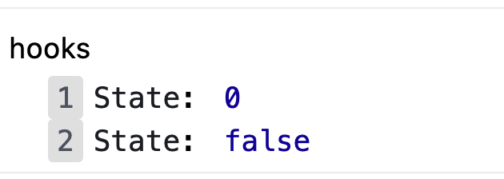

# React Hooks

- [ ] React Hooks 介绍 
- [ ] useState hook
- [ ] useEffect hook

## Hooks是什么？

**目标**：能够说出 React Hooks是什么？

**内容**：

- `Hooks`：钩子、钓钩、钩住
- `Hooks` 是 **React v16.8** 中的新增功能 
- 作用：为**函数组件**提供状态、生命周期等原本 class 组件中提供的 React 功能
  - 可以理解为通过 Hooks 为函数组件钩入 class 组件的特性
- 注意：**Hooks 只能在函数组件中使用**，自此，函数组件成为 React 的新宠儿

React v16.8 版本前后，组件开发模式的对比：

- React v16.8 以前： class 组件(提供状态) + 函数组件(展示内容)
- React v16.8 及其以后：
  1. class 组件(提供状态) + 函数组件(展示内容)
  2. Hooks(提供状态) + 函数组件(展示内容)
  3. 混用以上两种方式：部分功能用 class 组件，部分功能用 Hooks+函数组件

**总结**：

注意1：虽然有了 Hooks，但 *React 官方并没有计划从 React 库中移除 class*

注意2：有了 Hooks 以后，不能再把**函数组件**称为~~无状态组件~~了，因为 Hooks 为函数组件提供了状态

## 为什么要有 Hooks  

**目标**：能够说出为什么要有 Hooks 以及 Hooks 能解决什么问题

**内容**：

两个角度：1 组件的状态逻辑复用  2 class 组件自身的问题

1. 组件的状态逻辑复用：
   + 在 Hooks 之前，组件的状态逻辑复用经历了：mixins（混入）、HOCs（高阶组件）、render-props 等模式
   + （早已废弃）mixins 的问题：1 数据来源不清晰 2 命名冲突
   + HOCs、render-props 的问题：重构组件结构，导致组件形成 JSX 嵌套地狱问题

2. class 组件自身的问题：
   + 选择：函数组件和 class 组件之间的区别以及使用哪种组件更合适
   + 需要理解 class 中的 this 是如何工作的
   + 相互关联且需要对照修改的代码被拆分到不同生命周期函数中

- 相比于函数组件来说，不利于代码压缩和优化，也不利于 TS 的类型推导

**总结**：

正是由于 React 原来存在的这些问题，才有了 Hooks 来解决这些问题

## hooks渐进策略

**目标**：能够理解在react中什么场景应该使用hooks

**内容**：

+ react没有计划从React中移除 class [文档](https://zh-hans.reactjs.org/docs/hooks-intro.html)
+ Hooks 和现有代码可以同时工作，你可以渐进式地使用他们
  + 不推荐直接使用 Hooks 大规模重构现有组件 
  + 推荐：新功能用 Hooks，复杂功能实现不了的，也可以继续用 class
  + 找一个功能简单、非核心功能的组件开始使用 hooks
+ 之前的react语法并不是以后就不用了
  + class 组件相关的 API 在hooks中可以不用
    + class 自身语法，比如，constructor、static 等
    + 钩子函数，`componentDidMount`、`componentDidUpdate`、`componentWillUnmount`
    + `this` 相关的用法
  + **原来学习的 React 内容还是要用的**
    + JSX：`{}`、`onClick={handleClick}`、条件渲染、列表渲染、样式处理等
    + 组件：函数组件、组件通讯
    + React 开发理念：`单向数据流`、`状态提升` 等
    + 解决问题的思路、技巧、常见错误的分析等

**总结**：

1. react没有计划从React中移除class
2. react将继续为 class 组件提供支持
3. 可以在项目中同时使用hooks和class

## useState-基本使用 

**目标**：能够使用`useState`为函数组件提供状态

**内容：**

+ 一个 Hook 就是一个特殊的函数，让你在函数组件中获取状态等 React 特性
  + 从名称上看，Hook 都以` use `开头`useXxx`

- `useState`使用场景：当你想要在**函数组件中，使用组件状态时**，就要使用 **useState** Hook 了
- `useState`作用：为函数组件提供状态（state）
- 语法：

```js
import { useState } from 'react'

// 参数：状态初始值
// 返回值：stateArray 是一个数组
const stateArray = useState(0)

// 索引 0 表示：状态值（state）
const state = stateArray[0]
// 索引 1 表示：修改状态的函数（setState）
const setState = stateArray[1]
```

- 参数：**状态初始值**。比如，传入 0 表示该状态的初始值为 0

- 注意：此处的状态可以是任意值（比如，数值、字符串等），而 class 组件中的 state 必须是对象

**步骤**：

1. 导入 `useState` hook
2. 调用 `useState` 函数，并传入状态的初始值
3. 从 `useState` 函数的返回值中，拿到状态和修改状态的函数
4. 在 JSX 中展示状态
5. 在按钮的点击事件中调用修改状态的函数，来更新状态

**核心代码**：

```jsx
import { useState } from 'react'

const Count = () => {  
  // stateArray 是一个数组
  const stateArray = useState(0)

  const state = stateArray[0]
  const setState = stateArray[1]

  return (
    <div>
      {/* 展示状态值 */}
      <h1>状态为：{state}</h1>
      {/* 点击按钮，让状态值 +1 */}
      <button onClick={() => setState(state + 1)}>+1</button>
    </div>
  )
}
```

## useState-使用数组解构简化

**目标：**能够使用数组解构简化useState的使用

**内容**：

数组解构语法的说明，比如，要获取数组中的元素：

1. 原始方式：索引访问

```js
const arr = ['aaa', 'bbb']

const a = arr[0]  // 获取索引为 0 的元素
const b = arr[1]  // 获取索引为 1 的元素
```

2. 简化方式：数组解构
   - 相当于创建了两个变量（可以是任意的变量名称）分别获取到对应索引的数组元素

```js
const arr = ['aaa', 'bbb']

const [a, b] = arr
// a => arr[0]
// b => arr[1]

// 解构出来的名称，可以是任意变量名
const [state, setState] = arr
```

使用数组解构简化 `useState` 的使用

```jsx
import { useState } from 'react'

const Count = () => {
  // 解构：
  const [count, setCount] = useState(0)

  return (
    <div>
      <h1>计数器：{state}</h1>
      <button onClick={() => setState(state + 1)}>+1</button>
    </div>
  )
}
```

- 约定：**修改状态的函数名称以 set 开头，后面跟上状态的名称**
- 根据不同的功能，可以在解构时起不同的名称：

```js
// 解构出来的名称可以是任意名称，比如：

const [state, setState] = useState(0)
const [age, setAge] = useState(0)
const [count, setCount] = useState(0)
```

- 注意：多次调用 useState 多个状态和修改状态的函数之间不会相互影响

## useState-状态的读取和修改

**目标**：能够在函数组件中获取和修改状态

**内容：**

状态的使用：1 读取状态 2 修改状态

1. 读取状态：`useState` 提供的状态，是函数内部的局部变量，可以在函数内的任意位置使用

```jsx
const Counter = () => {
  const [user, setUser] = useState({ name: 'jack', age: 18 })
  
  return (
  	<div>
    	<p>姓名：{user.name}</p>
			<p>年龄：{user.age}</p>
    </div>
  )
}
```

2. 修改状态：

   - `setCount(newValue)` 是一个函数，参数表示：**新的状态值**

     - 调用该函数后，将**使用新的状态值`替换`旧值**
     - 修改状态后，因为状态发生了改变，所以，该组件会重新渲染

```jsx
const Counter = () => {
  const [user, setUser] = useState({ name: 'jack', age: 18 })
  
  const onAgeAdd = () => {
    setUser({
      ...user,
      age: user.age + 1
    })
  }
  
  return (
  	<div>
    	<p>姓名：{user.name}</p>
			<p>年龄：{user.age}</p>
     	<button onClick={onAgeAdd}>年龄+1</button>
    </div>
  )
}
```

**总结**：

1. 修改状态的时候，一定要**使用新的状态替换旧的状态**

## useState-组件的更新过程

**目标：**能够说出使用功能`useState`之后，组件的更新过程

**内容：**

函数组件使用 **useState** hook 后的执行过程，以及状态值的变化： 

- 组件第一次渲染：
  1. 从头开始执行该组件中的代码逻辑
  2. 调用 `useState(0)` 将传入的参数作为状态初始值，即：0
  3. 渲染组件，此时，获取到的状态 count 值为： 0

- 组件第二次渲染：
  1. 点击按钮，调用 `setCount(count + 1)` 修改状态，因为状态发生改变，所以，该组件会重新渲染
  2. 组件重新渲染时，会再次执行该组件中的代码逻辑
  3. 再次调用 `useState(0)`，此时 **React 内部会拿到最新的状态值而非初始值**，比如，该案例中最新的状态值为 1
  4. 再次渲染组件，此时，获取到的状态 count 值为：1

注意：**useState 的初始值(参数)只会在组件第一次渲染时生效**。

也就是说，以后的每次渲染，useState 获取到都是最新的状态值。React 组件会记住每次最新的状态值！

**核心代码**：

```jsx
import { useState } from 'react'

const Count = () => {
  const [count, setCount] = useState(0)

  return (
    <div>
      <h1>计数器：{count}</h1>
      <button onClick={() => setCount(count + 1)}>+1</button>
    </div>
  )
}
```

## useState-使用规则

**目标：**能够为函数组件提供多个状态

**内容：**

+ 如何为函数组件提供多个状态？

  + 调用 `useState` Hook 多次即可，每调用一次 useState Hook 可以提供一个状态
  + `useState Hook` 多次调用返回的 [state, setState]，相互之间，互不影响

+ useState 等 Hook 的使用规则：

  + **React Hooks 只能直接出现在 函数组件 中**
  + **React Hooks不能嵌套在 if/for/其他函数 中**
  + 原理：React 是按照 Hooks 的调用顺序来识别每一个 Hook，如果每次调用的顺序不同，导致 React 无法知道是哪一个 Hook
+ 可以通过开发者工具进行查看组件的 hooks：



## useEffect-副作用介绍

**目标：**能够说出什么是副作用

**内容：**

`side effect`：副作用

使用场景：当你想要在函数组件中，**处理副作用（side effect）时**，就要使用 **useEffect** Hook 了
作用：**处理函数组件中的副作用（side effect）**

问题：副作用（side effect）是什么? 
回答：在计算机科学中，如果一个函数或其他操作修改了其局部环境之外的状态变量值，那么它就被称为有副作用
类比，对于 999 感冒灵感冒药来说：

- （主）作用：用于感冒引起的头痛，发热，鼻塞，流涕，咽痛等 
- 副作用：可见困倦、嗜睡、口渴、虚弱感

理解：副作用是相对于主作用来说的，一个功能（比如，函数）除了主作用，其他的作用就是副作用
对于 React 组件来说，**主作用就是根据数据（state/props）渲染 UI**，除此之外都是副作用（比如，手动修改 DOM）

常见的副作用（side effect）：数据（Ajax）请求、手动修改 DOM、localStorage、console.log 操作等

**总结**：

​	对于react组件来说，除了渲染UI之外的其他操作，都可以称之为副作用

```jsx
let a = 1

const Count = () => {
  const [count, setCount] = useState(0)

  const handleClick = () => {
    setCount(count + 1)
  }
  
  console.log('aaa')
  axios.post('http://xxx')
  localStorage.setItem()
  a = 2
  
  return (
    <div>
      <h1>计数器：{count}</h1>
      <button onClick={handleClick}>+1</button>
    </div>
  )
}
```

## useEffect-基本使用

**目标：**能够在函数组件中操作DOM（处理副作用）

**内容：**

使用场景：当你想要在函数组件中，处理副作用（side effect）时就要使用 useEffect Hook 了

作用：处理函数组件中的一些副作用（side effect）

注意：在实际开发中，副作用是不可避免的。因此，react 专门提供了 **useEffect** Hook **来处理函数组件中的副作用**

语法：

- 参数：回调函数（称为 **effect**），就是**在该函数中写副作用代码**
- 执行时机：该 effect 会在组件第一次渲染以及每次组件更新后执行
- 相当于 componentDidMount + componentDidUpdate

```jsx
import { useEffect } from 'react'

useEffect(function effect() {
  document.title = `当前已点击 ${count} 次`
})

useEffect(() => {
  document.title = `当前已点击 ${count} 次`
})
```

示例：

```jsx
import { useEffect } from 'react'

const Counter = () => {
  const [count, setCount] = useState(0)
  
  useEffect(() => {
    document.title = `当前已点击 ${count} 次`
  })
  
  return (
  	<div>
    	<h1>计数器：{count}</h1>
      <button onClick={() => setCount(count + 1)}>+1</button>
    </div>
  )
}
```

## useEffect-依赖

**目标：**能够设置 useEffect 的依赖只在 count 变化时执行相应的 effect

**内容：**

- 问题：如果组件中有另外一个状态，另一个状态更新时，刚刚的 effect 回调也会执行 
- 默认情况：只要状态发生更新 useEffect 的 effect 回调就会执行
- 性能优化：**跳过不必要的执行，只在 count 变化时，才执行相应的 effect**

- 语法：
  - 第二个参数：可选，也可以传一个数组，数组中的元素可以成为依赖项（deps） 
  - 该示例中表示：只有当 count 改变时，才会重新执行该 effect

```js
  useEffect(() => {
    document.title = `当前已点击 ${count} 次`
  }, [count])
```

**核心代码：**

```js
import { useEffect } from 'react'

const Counter = () => {
  const [count, setCount] = useState(0)
  const [loading, setLoading] = useState(false)
  
  useEffect(() => {
    document.title = `当前已点击 ${count} 次`
  }, [count])
  
  return (
  	<div>
    	<h1>计数器：{count}</h1>
      <button onClick={() => setCount(count + 1)}>+1</button>
      <button onClick={() => setCount(!loading)}>切换 loading</button>
    </div>
  )
}
```

## useEffect-不要对依赖项撒谎

**目标：**能够理解不正确使用依赖项的后果

**内容：**

- useEffect 回调函数（effect）中用到的数据（比如，count）就是依赖数据，就应该出现在依赖项数组中
- 如果 useEffect 回调函数中用到了某个数据，但是，没有出现在依赖项数组中，就会导致一些 Bug 出现！
- 所以，不要对 useEffect 的依赖撒谎 

```jsx
const App = () => {
  const [count, setCount] = useState(0)
  
  // 错误演示：
  useEffect(() => {
    document.title = '点击了' + count + '次'
  }, [])
  
  return (
    <div>
      <h1>计数器：{count}</h1>
      <button onClick={() => setCount(count + 1)}>+1</button>
    </div>
  )
}
```

> useEffect完全指南：https://overreacted.io/zh-hans/a-complete-guide-to-useeffect/

## useEffect-依赖是一个空数组

**目标：**能够设置useEffect的依赖，让组件只有在第一次渲染后会执行

**内容**：

- useEffect 的第二个参数，还可以是一个**空数组（[]）**，表示只在组件第一次渲染后执行 effect

- 使用场景：1 事件绑定  2 发送请求获取数据 等

- 语法：
  - 该 effect 只会在组件第一次渲染后执行，因此，可以执行像事件绑定等只需要执行一次的操作
  - 此时，相当于 class 组件的 componentDidMount 钩子函数的作用

```js
useEffect(() => {
  const handleResize = () => {}
  window.addEventListener('resize', handleResize)
}, [])
```

注意：

- 跟 useState Hook 一样，一个组件中也可以调用 useEffect Hook 多次 
- 推荐：**一个 useEffect 只处理一个功能，有多个功能时，使用多次 useEffect**

## useEffect-清理工作

**目标：**能够在组件卸载的时候清除注册的事件

**内容：**

- effect 的**返回值**是可选的，可省略。也可以返回一个**清理函数**，用来执行事件解绑等清理操作
- 清理函数的执行时机：
  - **清理函数**会在组件卸载时以及下一次副作用回调函数调用的时候执行，用于清除上一次的副作用。
  - 如果依赖项为空数组，那么会在组件卸载时会执行。相当于组件的`componetWillUnmount`

**核心代码：**

```jsx
useEffect(() => {
  const handleResize = () => {}
  window.addEventListener('resize', handleResize)
  
  // 这个返回的函数，会在该组件卸载时来执行
  // 因此，可以去执行一些清理操作，比如，解绑 window 的事件、清理定时器 等
  return () => window.removeEventListener('resize', handleResize)
}, [])
```
## useEffect-语法总结

**目标：**能够说出useEffect的 4 种使用使用方式

**内容**：

```js
// 1
// 触发时机：1 第一次渲染会执行 2 每次组件重新渲染都会再次执行
// componentDidMount + ComponentDidUpdate
useEffect(() => {})

// 2（使用频率最高）
// 触发时机：只在组件第一次渲染时执行
// componentDidMount
useEffect(() => {}, [])

// 3（使用频率最高）
// 触发时机：1 第一次渲染会执行 2 当 count 变化时会再次执行
// componentDidMount + componentDidUpdate（判断 count 有没有改变）
useEffect(() => {}, [count])

// 4
useEffect(() => {
  // 返回值函数的执行时机：组件卸载时
  // 在返回的函数中，清理工作
  return () => {
  	// 相当于 componentWillUnmount
  }
}, [])

useEffect(() => {
  
  // 返回值函数的执行时机：1 组件卸载时 2 count 变化时
  // 在返回的函数中，清理工作
  return () => {}
}, [count])
```

## useEffect应用-发送请求

**目的：**能够在函数组件中通过useEffect发送ajax请求

**内容：**

+ 在组件中，可以使用 useEffect Hook 来发送请求（side effect）获取数据

+ 注意：**effect 只能是一个同步函数，不能使用 async**
  + 因为如果 effect 是 async 的，此时返回值是 Promise 对象。这样的话，就无法保证清理函数被立即调用
+ 为了使用 async/await 语法，可以在 effect 内部创建 async 函数，并调用

**核心代码：**

```jsx
// 错误演示：不要给 effect 添加 async
useEffect(async () => {
  const res = await axios.get('http://xxx')
  return () => {}
}, [])

// 正确使用
useEffect(() => {
  const loadData = async () => {
    const res = await axios.get('http://xxx')
  }
  loadData()
  
  return () => {}
}, [])
```

## 购物车案例


### 1. 项目初始化

**目标**：能够使用 React 脚手架创建项目并根据模板搭建页面结构

**分析说明**：

- 注意：React 脚手架默认支持 `sass`，但是需要自己手动安装 `sass` 依赖包（用来解析 sass 语法）
- 安装命令：`yarn add sass`

**步骤**：

1. 清理项目目录
2. 根据模板搭建基本页面结构
3. 安装解析 sass 的包：`yarn add sass`，重启项目

3. 安装 bootstrap：`yarn add bootstrap@4.5.0`，并导入 bootstrap 样式文件

**核心代码**：

index.js 中：

```jsx
// 导入 bootstrap 样式文件：
import 'bootstrap/dist/css/bootstrap.css'
```

### 2. 封装CartHeader组件

**目标**：能够封装购物车的CartHeader组件

**步骤**：

1. 新建 components/CartHeader/index.js 文件
2. 在该文件中，通过函数组件创建 CartHeader 组件
3. 通过 children 属性，接收传递过来的标题
4. 在 App 组件中导入 CartHeader 组件并渲染

**核心代码**：

src/components/CartHeader/index.js 中：

```jsx
import './index.scss'

// 按需导出
export const CartHeader = ({ children }) => {
  return <div className="Cart-header">{children}</div>
}
```

src/components/CartHeader/index.scss 中：

```scss
.Cart-header {
  z-index: 999;
  height: 45px;
  line-height: 45px;
  text-align: center;
  background-color: #1d7bff;
  color: #fff;
  position: fixed;
  top: 0;
  left: 0;
  width: 100%;
}
```

App.js 中：

```jsx
// 按需导入组件
import { CartHeader } from './components/CartHeader'

const App = () => {
  return (
    <div>
      <CartHeader>购物车</CartHeader>
    </div>
  )
}
```

### 3. 封装CartFooter组件

**目标：**能够封装购物车的CartFooter组件


**步骤**

1. 创建 CartFooter 组件
2. 创建 CartFooter 组件的样式文件
3. 在 App 组件中渲染

**核心代码：**

src/components/CartFooter/index.js 中：

```jsx
import './index.scss'
export const CartFooter = () => {
  return (
    <div className="Cart-footer">
      <div className="custom-control custom-checkbox">
        <input type="checkbox" className="custom-control-input" id="footerCheck" />
        <label className="custom-control-label" htmlFor="footerCheck">全选</label>
      </div>
      <div>
        <span>合计:</span>
        <span className="price">¥ 100</span>
      </div>
      <button type="button" className="footer-btn btn btn-primary">结算 (0)</button>
    </div>
  )
}
```

src/components/CartFooter/index.scss 中：

```scss
.Cart-footer {
  z-index: 999;
  position: fixed;
  bottom: 0;
  width: 100%;
  height: 50px;
  border-top: 1px solid #ccc;
  display: flex;
  justify-content: space-between;
  align-items: center;
  padding: 0 10px;
  background: #fff;

  .price {
    color: red;
    font-weight: bold;
    font-size: 15px;
  }
  .footer-btn {
    min-width: 80px;
    height: 30px;
    line-height: 30px;
    border-radius: 25px;
    padding: 0;
  }
}
```

App.js 中：

```jsx
import { CartFooter } from './components/CartFooter'

const App = () => {
  return (
    <div>
      <CartFooter />
    </div>
  )
}
```

### 4. 封装GoodsItem组件

**目标：**能够封装GoodsItems组件

**步骤**：

1. 创建 GoodsItem 组件
2. 提供 GoodsItem 组件的样式文件
3. 在 App 组件中渲染该组件
4. 为 App 组件添加样式，进行样式调整

**核心代码**：

src/components/GoodsItem/index.js 中：

```jsx
import './index.scss'
export const GoodsItem = () => {
  return (
    <div className="my-goods-item">
      <div className="left">
        <div className="custom-control custom-checkbox">
          <input type="checkbox" className="custom-control-input" id="input" />
          <label className="custom-control-label" htmlFor="input">
            
          </label>
        </div>
      </div>
      <div className="right">
        <div className="top">商品名称</div>
        <div className="bottom">
          <span className="price">¥ 商品价格</span>
          <span>counter组件</span>
        </div>
      </div>
    </div>
  )
}
```

src/components/GoodsItem/index.scss 中：

```scss
.Cart-goods-item {
  display: flex;
  padding: 10px;
  border-bottom: 1px solid #ccc;
  .left {
    img {
      width: 120px;
      height: 120px;
      margin-right: 8px;
      border-radius: 10px;
    }
    .custom-control-label::before,
    .custom-control-label::after {
      top: 50px;
    }
  }
  .right {
    flex: 1;
    display: flex;
    flex-direction: column;
    justify-content: space-between;
    .bottom {
      display: flex;
      justify-content: space-between;
      padding: 5px 0;
      .price {
        color: red;
        font-weight: bold;
      }
    }
  }
}

```

App.js 中：

```jsx
import { GoodsItem } from './components/GoodsItem'

export default function App() {
  return (
    <div className="app">
      <GoodsItem />
    </div>
  )
}
```

App.scss 中：

```scss
.app {
  padding-top: 45px;
  padding-bottom: 50px;
}
```

### 5. 商品列表渲染

**目标**：能够完成商品列表的数据渲染

**步骤：**

1. 将购物车数据的 json 拷贝到项目的根目录中
2. 使用 json-server 提供一个数据接口：`npx json-server ./data.json --port 8888`
3. 安装 axios：`yarn add axios`
4. 在 App 中创建商品列表的状态
5. 渲染页面时，在 App 组件中通过 axios 发送请求获取数据
6. 拿到接口返回的数据，更新到状态中，并渲染列表

**核心代码**：

App.js 中：

```jsx
import axios from 'axios'
import { useEffect, useState } from 'react'

const http = axios.create({
  baseURL: 'http://localhost:8888'
})

export default function App() {
  const [goodsList, setGoodsList] = useState([])

  useEffect(() => {
    const loadData = async () => {
      const res = await htpp.get('/goodsList')
      setGoodsList(res.data)
    }
    loadData()
  }, [])

  return (
    <div className="app">
      {/* 商品列表项 */}
      {goodsList.map(item => (
        <GoodsItem key={item.id} {...item} />
      ))}
    </div>
  )
}
```

GoodsItem/index.js 中：

```jsx
export const GoodsItem = ({
  goods_count,
  goods_img,
  goods_name,
  goods_price,
  goods_state,
  id
}) => {
  return (
    <div className="my-goods-item">
      <div className="left">
        <div className="custom-control custom-checkbox">
          <input type="checkbox" className="custom-control-input" id={`input-${id}`} />
          <label className="custom-control-label" htmlFor={`input-${id}`}>
            
          </label>
        </div>
      </div>
      <div className="right">
        <div className="top">{goods_name}</div>
        <div className="bottom">
          <span className="price">¥ {goods_price}</span>
          <span>counter组件</span>
        </div>
      </div>
    </div>
  )
}
```

### 6. 商品选中功能

**目标**：能够完成商品的选中切换功能

**分析说明**：对于 checkbox 表单项来说，在使用受控组件获取值的时候，需要指定 `checked` 属性

**步骤：**

1. 在 GoodsItem 组件中通过传递过来的选中状态值作为复选框的 checked 值
2. 将 id 和 修改后的选中状态值回传给父组件
3. 父组件中准备一个用于修改修改选中状态的回调函数
4. 回调函数中，根据接收到的数据修改本地商品列表数据
5. 回调函数中，更新接口中的选中状态数据

**核心代码**

GoodsItem/index.js 中：

```jsx
<input
  type="checkbox"
  className="custom-control-input"
  checked={goods_state}
  onChange={e => changeState(id, e.target.checked)}
/>
```

App.js 中：

```jsx
const changeGoodsState = async (id, goods_state) => {
  setGoodsList(
    goodsList.map(item => {
      if (item.id === id) {
        return {
          ...item,
          goods_state
        }
      }
      return item
    })
  )

  await http.patch(`/goodsList/${id}`, {
    goods_state
  })
}

// ...
<GoodsItem
  changeGoodsState={changeGoodsState}
/>
```

### 7. 商品全选功能

**目标**：能够完成商品全选切换功能

**分析说明**：

全选按钮是否选中，分为 3 种情况：

1. 进入页面时，判断所有商品是否都选中，如果都选中了，让全选按钮也选中；否则，不选中
2. 切换全选按钮的选中状态，商品的选中状态会随之切换
3. 切换商品的选中状态，全选按钮的选中状态会随之切换

因此，GoodsItem 和 CartFooter 组件都需要操作全选按钮的选中状态。所以，应该将 全选按钮的选中状态 提升到父组件 App 中（状态提升）

接下来，按照上面的 3 种情况，来实现该功能。

情况1：进入页面控制全选按钮的选中状态

**步骤**：

1. 在 App 父组件中添加控制全选按钮选中状态 checkAll
2. 将 checkAll 传递给子组件 CartFooter
3. 在 CartFooter 中通过 props 接收到 checkAll
4. 将 checkAll 作为全选按钮的 checked 属性值
5. 为全选按钮提供 change 事件，并调用 changeCheckAll 回调，将全选按钮的选中状态回传给父组件
6. 在 App 中提供 changeCheckAll 回调函数，更新状态，并将该函数传递给 CartFooter 子组件

**核心代码：**

App.js 中：

```jsx
export default function App() {
  const [checkAll, setCheckAll] = useState(false)

  useEffect(() => {
    const loadData = async () => {
      const res = await http.get('/goodsList')
      const list = res.data
      setGoodsList(list)

      setCheckAll(list.every(item => item.goods_state))
    }
    loadData()
  }, [])
  
  const changeCheckAll = checkAll => {
    setCheckAll(checkAll)
  }
  
  return (
  	// ...
    <CartFooter checkAll={checkAll} changeCheckAll={changeCheckAll} />
  )
}
```

CartFooter.js 中：

```jsx
export const CartFooter = ({ checkAll, changeCheckAll }) => {
  return (
    <div className="my-footer">
      <div className="custom-control custom-checkbox">
        <input
          type="checkbox"
          className="custom-control-input"
          id="footerCheck"
          checked={checkAll}
          onChange={e => changeCheckAll(e.target.checked)}
        />
        <label className="custom-control-label" htmlFor="footerCheck">
          全选
        </label>
      </div>
      <div>
        <span>合计:</span>
        <span className="price">¥ 100</span>
      </div>
      <button type="button" className="footer-btn btn btn-primary">
        结算 (0)
      </button>
    </div>
  )
}
```

情况2：切换全选按钮的选中状态，控制商品的选中状态

**分析说明**：

- 注意：`json-server` 提供的接口，无法批量更新数据，只能自己遍历所有数据，分别修改每个商品的选中状态

- 问题：如果要循环发送请求，更新数据，最好在启动 json-server 时，去掉 `--watch` 命令。否则，可能会出现请求失败失败的情况

- 原因：`--watch` 命令会监视 json 文件的变化，如果数据变化了 json-server 或重新读取 json 文件中的数据并重启 json-server。
  - 如果正好在重启过程中发送了请求，这个请求就可能无法链接到接口，导致请求失败

**步骤**：

1. 根据全选按钮的选中状态，修改本地商品数据的选中状态
2. 遍历所有商品，分别发送请求，修改每个商品的选中状态

**核心代码**：

App.js 中：

```jsx
const changeCheckAll = checkAll => {
  setCheckAll(checkAll)

  // 本地数据状态修改
  setGoodsList(
    goodsList.map(item => {
      return {
        ...item,
        goods_state: checkAll
      }
    })
  )

  // 接口数据状态修改
  goodsList.forEach(item =>
  	http.patch(`/goodsList/${item.id}`, {
  		goods_state: checkAll
  	})
  )
}

```

情况3：切换商品的选中状态，控制全选按钮的选中状态

**核心代码**：

App.js 中：

```js
const changeGoodsState = async (id, goods_state) => {
  // 拿到要跟新的 goodsList 值
  const newGoodsList = goodsList.map(item => {
    if (item.id === id) {
      return {
        ...item,
        goods_state
      }
    }
    return item
  })
  setGoodsList(newGoodsList)
  // 注意：此处遍历的是 newGoodsList 
  setCheckAll(newGoodsList.every(item => item.goods_state))
	
  // ...
}
```

### 8. 展示结算数量与总价

**目标**：能够展示结算数量和总价格

**步骤：**

1. 在 App 组件中计算总数量和总价格
2. 传递给子组件来展示

**核心代码**：

App.js 中：

```jsx
const totalCount = goodsList.reduce((count, item) => {
  if (item.goods_state) {
    return count + item.goods_count
  }
  return count
}, 0)

const totalPrice = goodsList.reduce((count, item) => {
  if (item.goods_state) {
    return count + item.goods_count * item.goods_price
  }
  return count
}, 0)

return (
	<CartFooter
    totalCount={totalCount}
    totalPrice={totalPrice}
  />
)
```

CartFooter.js 中：

```jsx
export const CartFooter = ({
  totalCount,
  totalPrice
}) => {
  return (
    <div className="my-footer">
			// ...
      <div>
        <span>合计:</span>
        <span className="price">¥ {totalPrice}</span>
      </div>
      <button type="button" className="footer-btn btn btn-primary">
        结算 ({totalCount})
      </button>
    </div>
  )
}
```

### 9. 封装CartCounter组件

**目标**：能够搭建CartCounter组件的基本结构

**步骤**：

1. 根据模板代码创建 CartCounter 组件

**核心代码**：

CartCounter/index.js 中：

```jsx
import './index.scss'
export const CartCounter = () => {
  return (
    <div className="my-counter">
      <button type="button" className="btn btn-light">
        -
      </button>
      <input type="input" className="form-control inp" />
      <button type="button" className="btn btn-light">
        +
      </button>
    </div>
  )
}
```

CartCounter/index.scss 中：

```scss
.my-counter {
  display: flex;
  .inp {
    width: 45px;
    text-align: center;
    margin: 0 10px;
  }
}
```

GoodsItem/index.js 中：

```jsx
import { CartCounter } from '../CartCounter'

// 渲染
<CartCounter />
```

### 10. 实现商品数量修改

**目标**：能够实现商品数量的修改

**分析说明**：

组件层级关系：App  => GoodsItem => CartCounter

App 组件中维护了商品列表数据，也包括商品数量，所以，CartCounter 中如果要修改数量的话，也要修改 App 组件中的商品列表数据

此时，就会涉及到跨组件传递数据，因此，可以通过 Context 来实现

并且，Context 在使用时，Provider 和 Consumer 必须成对出现，因此，为了App 和 CartCounter 组件中都能操作同一个 Context，可以将

Context 对象放到一个单独的文件中来创建。App 和 CartCounter 组件分别导入即可。

**步骤**：

1. 在 src 目录中创建 count-context.js 文件
2. 在该文件中创建 Context 对象，并导出
3. 在 App 组件中，导入 Context 对象，并使用 Provider 包裹整个组件的内容
4. 为 Provider 提供 value 属性，值为修改购物车数量的函数
5. 在 CartCounter 组件中，导入 Contex 对象
6. 通过 useContext hook 拿到共享的修改购物车数量的函数
7. 调用该函数来修改购物车数量

**核心代码**：

src/count-context.js 中：

```js
import { createContext } from 'react'

export const CountContext = createContext(() => {})
```

App.js 中：

```jsx
import { CountContext } from './count-context'

function App() {
  const changeCount = async (id, goods_count) => {
    setGoodsList(
    	goodsList.map(item => {
        if (item.id === id) {
          return {
            ...item,
            goods_count
          }
        }
        return item
      })
    )
    
    await http.patch(`/goodsList/${id}`, {
      goods_count
    })
  }
  
  return (
  	<CountContext.Provider value={{ changeCount }}>
    	// ...
    </CountContext.Provider>
  )
}
```

CartCounter/index.js 中：

```jsx
import { useContext } from 'react'
import { CountContext } from '../../count-context'

const CartCounter = ({ id, count }) => {
  const { changeCount } = useContext(CountContext)
  
	return (
  	<div className="my-counter">
      <button type="button" className="btn btn-light" onClick={() => changeCount(id, count - 1)}>
        -
      </button>
      <input type="input" className="form-control inp" value={count} onChange={e => changeCount(id, +e.target.value)} />
      <button type="button" className="btn btn-light" onClick={() => changeCount(id, count + 1)}>
        +
      </button>
    </div>
  )
}
```

## 补充：useState 和 class 状态对比

1. class 组件中的修改状态的函数：

```js
class Counter extends React.Component {
  state = {
    count: 0
  }

	handleClick = () => {
    // 1 第一个参数是对象
    this.setState({
      count: this.state.count + 1
    })
    
    // 2 第一个参数是回调函数
    this.setState(prevState => {
      return {
        count: prevState.count + 1
      }
    })
    
    // 3 可以有第二个参数
    this.setState({
      count: this.state.count + 1
    }, () => {})
  }
}
```

2. hooks 中修改状态的函数：

```js
const [count, setCount] = useState(0)

// 此处的  setCount 和 class 中的 this.setState 作用是相同的，都是用来更新状态

// 1 参数就是要更新的状态值
setCount(count + 1)

// 2 参数是回调函数。回调函数的参数，表示：上一次的状态值（count 上一次的值）
setCount(prevCount => prevCount + 1)
```

