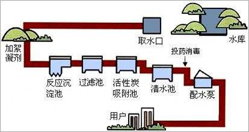
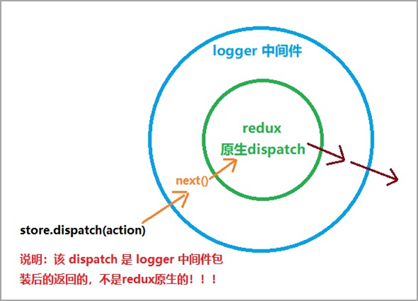
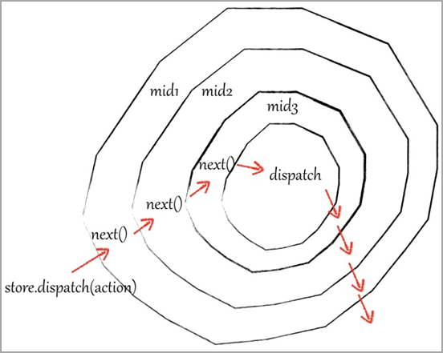

# Redux 中间件

## 中间件概述

**目标：** 能够理解为什么需要redux中间件

**内容：**

默认情况下，Redux 自身只能处理同步数据流。但是在实际项目开发中，状态的更新、获取，通常是使用异步操作来实现。

- 问题：如何在 Redux 中进行异步操作呢? 
- 回答：通过 Redux 中间件机制来实现

Redux 中间件作用：**处理具有副作用(side effect)的功能**，比如，异步操作就是最常见的 side effect

中间件说明：

- 中间件，可以理解为处理一个功能的中间环节
- 下图中，自来水从水库到用户家庭中的每一个环节都是一个中间件
- 中间件的优势：可以串联、组合，在一个项目中使用多个中间件
- **Redux 中间件用来处理 状态 更新，也就是在 状态 更新的过程中，执行一系列的相应操作**



## 中间件的触发时机

**目标**：能够理解中间件的触发时机

**内容**：

- Redux 中间件执行时机：**在 dispatching action 和 到达 reducer 之间**。
- 没有中间件：`dispatch(action) => reducer`


- 使用中间件：`dispatch(action) => 执行中间件代码 => reducer`


- 原理：封装了 redux 自己的 dispatch 方法
  - 没有中间件：`store.dispatch()` 就是 Redux 库自己提供的 dispatch 方法，用来发起状态更新
  - 使用中间件：`store.dispatch()` 就是中间件封装处理后的 dispatch，但是，最终一定会调用 Redux 自己的 dispatch 方法发起状态更新

## redux-logger中间件

**目标**：能够使用redux-logger中间件记录日志

**步骤**：

1. 安装：`yarn add redux-logger`
2. 导入 redux-logger 中间件
3. 从 redux 中导入 `applyMiddleware` 函数
4. 调用 applyMiddleware() 并传入 logger 中间件作为参数
5. 将 applyMiddleware() 调用作为 createStore 函数的第二个参数

然后，调用 store.dispatch() 查看 console 中 logger 中间件记录的日志信息

**核心代码**：

store/index.js 中：

```js
import { createStore, applyMiddleware } from 'redux'
import logger from 'redux-logger'
import rootReducer from './reducers'

const store = createStore(rootReducer, applyMiddleware(logger))
```

## redux-thunk中间件

**目标**：能够使用redux-thunk中间件处理异步操作

**内容**：

`redux-thunk` 中间件可以处理`函数形式的 action`。因此，在函数形式的 action 中就可以执行异步操作

语法：

- thunk action 是一个函数
- 函数包含两个参数：1 dispatch 2 getState

```js
// 函数形式的 action
const thunkAction = () => {
  return (dispatch, getState) => {}
}

// 解释：
const thunkAction = () => {
  // 注意：此处返回的是一个函数，返回的函数有两个参数：
	// 第一个参数：dispatch 函数，用来分发 action
  // 第二个参数：getState 函数，用来获取 redux 状态
  return (dispatch, getState) => {
    setTimeout(() => {
      // 执行异步操作
      // 在异步操作成功后，可以继续分发对象形式的 action 来更新状态
    }, 1000)
  }
}
```

使用 `redux-thunk` 中间件前后对比：

1. 不使用 redux-thunk 中间件，action 只能是一个对象

```js
// 1 普通 action 对象
{ type: 'counter/increment' }
dispatch({ type: 'counter/increment' })

// 2 action creator
const increment = payload => ({ type: 'counter/increment', payload })
dispatch(increment(2))
```

2. **使用 redux-thunk 中间件后，action 既可以是对象，又可以是函数**

```js
// 1 对象：
// 使用 action creator 返回对象
const increment = payload => ({ type: 'counter/increment', payload })
// 分发同步 action
dispatch(increment(2))

// 2 函数：
// 使用 action creator 返回函数
const incrementAsync = () => {
  return (dispatch, getState) => {
    // ... 执行异步操作代码
  }
}
// 分发异步 action
dispatch(incrementAsync())
```

**步骤**：

1. 安装：`yarn add redux-thunk`
2. 导入 redux-thunk
3. 将 thunk 添加到 applyMiddleware 函数的参数（中间件列表）中
4. 创建函数形式的 action，在函数中执行异步操作

**核心代码**：

store/index.js 中：

```js
// 导入 thunk 中间件
import thunk from 'redux-thunk'
// 将 thunk 添加到中间件列表中
// 知道：如果中间件中使用 logger 中间件，logger 中间件应该出现在 applyMiddleware 的最后一个参数
const store = createStore(rootReducer, applyMiddleware(thunk, logger))
```

actions/index.js 中：

```js
export const clearAllAsync = () => {
  return (dispatch) => {
    // 处理异步的代码：1 秒后再清理已完成任务
    setTimeout(() => {
      dispatch(clearAll())
    }, 1000)
  }
}
```

App.js 中：

```jsx
import { clearTodoAsync } from '../store/actions/todos'

const TodoFooter = () => {
	return (
    // ...
  	<button
      className="clear-completed"
      onClick={() => dispatch(clearTodoAsync())}
    >
      Clear completed
    </button>
  )
}
```

## 了解：redux-thunk中间件原理

**目标**：能够了解redux-thunk中间件的原理

**内容**：

- [redux-thunk@v2.3 源码链接](https://github.com/reduxjs/redux-thunk/blob/v2.3.0/src/index.js)

```js
function createThunkMiddleware(extraArgument) {
  // Redux 中间件的写法：const myMiddleware = store => next => action => { /* 此处写 中间件 的代码 */ }
  return ({ dispatch, getState }) => (next) => (action) => {
    // redux-thunk 的核心代码：
    // 判断 action 的类型是不是函数
    
    // 如果是函数，就调用该函数（action），并且传入了 dispatch 和 getState
    if (typeof action === 'function') {
      return action(dispatch, getState, extraArgument);
    }
    
    // 如果不是函数，就调用下一个中间件（next），将 action 传递过去
    // 如果没有其他中间件，那么，此处的 next 指的就是：Redux 自己的 dispatch 方法
    return next(action);
  };
}

// 所以，在使用了 redux-thunk 中间件以后，那么，redux 就既可以处理 对象形式的 action 又可以处理 函数形式的 action 了
// 1 处理对象形式的 action
dispatch({ type: 'todos/clearAll' }) // 对应上面第 14 行代码

// 2 处理函数型的 action
export const clearAllAsync = () => {
  return dispatch => {
    // 在此处，执行异步操作
    setTimeout(() => {
      // 异步操作完成后，如果想要修改 redux 中的状态，就必须要
      // 分发一个 对象形式的 action（同步的 action）
      dispatch({ type: types.CLEAR_ALL })
    }, 1000)
  }
}
dispatch(clearAllAsync()) // 对应上面第 8、9 行代码
```

## redux-devtools-extension中间件

**目标**：能够使用chrome开发者工具调试跟踪redux状态

**内容**：

-  [redux-devtools-exension 文档](https://www.npmjs.com/package/redux-devtools-extension)  
- 先给 Chrome 浏览器安装 redux 开发者工具，然后，就可以查看 Redux 状态了

**步骤**：

1. 安装： `yarn add redux-devtools-extension`
2. 从该中间件中导入 composeWithDevTools 函数
3. 调用该函数，将 applyMiddleware() 作为参数传入
4. 打开 Chrome 浏览器的 redux 开发者工具并使用

```jsx
import thunk from 'redux-thunk'
import { composeWithDevTools } from 'redux-devtools-extension'

const store = createStore(reducer, composeWithDevTools(applyMiddleware(thunk)))

export default store
```

## 了解：redux 中间件原理

- Redux 中间件原理：创建一个函数，**包装 store.dispatch**，使用新创建的函数作为新的 dispatch
- 比如下图，logger 就是一个中间件，使用该中间件后 store.dispatch 就是包装后的新 dispatch
- 中间件修改了 store.dispatch，在分发动作和到达 reducer 之间提供了扩展
- redux 中间件采用了 **洋葱模型** 来实现

<figure class="third">
  
  
</figure>

- 自己实现记录日志的 redux 中间件：

```js
// 简化写法：
// store 表示：redux 的 store
// next 表示：下一个中间件，如果只使用一个中间，那么 next 就是 store.dispatch（redux 自己的 dispatch 函数）
// action 表示：要分发的动作
const logger = store => next => action => {
  console.log('prev state:', store.getState()) // 更新前的状态
  // 记录日志代码
  console.log('dispatching', action)
  // 如果只使用了一个中间件：
  // 那么，next 就表示原始的 dispatch
  // 也就是：logger中间件包装了 store.dispatch
  let result = next(action)
  // 上面 next 代码执行后，redux 状态就已经更新了，所以，再 getState() 拿到的就是更新后的最新状态值
  // 记录日志代码
  console.log('next state', store.getState()) // 更新后的状态
  return result
}

// 完整写法：
const logger = store => {
  return next => {
    return action => {
      // 中间件代码写在这个位置：
    }
  }
}
```

## 理解Redux异步数据流

**目标**：能够说出redux的异步数据流动过程

**内容**：


## 综合案例-黑马头条

接口说明

- 获取频道列表：http://geek.itheima.net/v1_0/channels

- 获取频道新闻：http://geek.itheima.net/v1_0/articles?channel_id=频道id&timestamp=时间戳

### 1. 结构搭建

**目标**：能够根据模板搭建案例结构

**内容**：使用准备好的模板内容搭建项目

### 2. 配置Redux基本结构

**目标**：能够在黑马头条案例中配置Redux

**步骤**：

1. 安装 redux：`yarn add redux`
2. 在 src 目录中创建 store 文件夹
3. 在 store 目录中创建 actions、reducers、actionTypes 目录以及 index.js 文件
4. 在 reducers 目录中新建 channels.js、articles.js 和 index.js 文件
5. 分别创建 channels 和 articles reducer 并导出
6. 在 reducers/index.js 中创建根 reducer 并导出
7. 在 store/index.js 中，导入根 reducer 并创建 store 然后导出

**核心代码**：

store/reducers/channel.js 中：

```js
// 默认值：
const initialState = {
  list: [],
  activeId: 0
}

export const channels = (state = initialState, action) => {
  return state
}
```

store/reducers/articleList.js 中：

```js
// 默认值：
const initialState = []

export const articles = (state = initialState, action) => {
  return state
}
```

store/reducers/index.js 中：

```js
import { combineReducers } from 'redux'

import { channels } from './channels'
import { articles } from './articles'

const rootReducer = combineReducers({
  channels,
  articles
})

export default rootReducer
```

store/index.js 中：

```js
import { createStore } from 'redux'
import rootReducer from './reducers'

const store = createStore(rootReducer)

export default store
```

### 3. 配置 redux 中间件

**目标**：能够配置redux的 thunk 中间件和开发者工具

**步骤**：

1. 安装：`yarn add redux-thunk redux-devtools-extension`
2. 在 store 中导入两个包
3. 创建 store 时，设置为 redux 的中间件

**核心代码**：

store/index.js 中：

```js
import { applyMiddleware } from 'redux'
import { composeWithDevTools } from 'redux-devtools-extension'
import thunk from 'redux-thunk'

const store = createStore(rootReducer, composeWithDevTools(applyMiddleware(thunk)))
```

### 4. 配置React-Redux

**目标**：能够在 todomvc 案例中配置 react-redux

**步骤**：

1. 安装 react-redux：`yarn add react-redux`
2. 在 src/index.js 中，导入 Provider 组件
3. 在 src/index.js 中，导入创建好的 store
4. 使用 Provider 包裹 App 组件，并设置其 store 属性

**核心代码**：

src/index.js 中：

```js
import { Provider } from 'react-redux'
import store from './store'
import App from './App'

ReactDOM.render(
  <Provider store={store}>
    <App />
  </Provider>,
  document.querySelector('#root')
)
```

### 5. 获取频道数据

**目标**：能够获取频道数据

**分析说明**：

对于频道数据来说，需要进入页面时就获取。因此，可以通过 `useEffect` hook 来实现。

**步骤**：

1. 在 Channel 组件中通过 useEffect hook 分发获取频道数据的 action
2. 创建 actionTypes/channels.js 文件，创建获取频道数据的 action type
3. 创建 actions/channels.js 文件，创建获取频道数据的 thunk action
4. 在该 thunk action 发送请求，获取频道数据
5. 拿到数据后，再次分发 action 将拿到的频道数据存储到 redux 中
6. 在 reducers/channels.js 文件中，将频道数据存储到 redux 中

**核心代码**：

Channel.js 中：

```jsx
import { useEffect } from 'react'
import { useDispatch } from 'react-redux'
import { getChannels } from '../store/actions/channels'

export const Channel = () => {
  const dispatch = useDispatch()

  useEffect(() => {
    dispatch(getChannels())
  }, [dispatch])
	
  // ...
}
```

actionTypes/channels.js 中：

```js
// 获取频道数据
export const GET_CHANNELS = 'channels/get'
```

actions/channels.js 中：

```js
import * as types from '../actionTypes/channels'
import axios from 'axios'

export const getChannels = () => {
  return async dispatch => {
    const res = await axios.get('http://toutiao.itheima.net/v1_0/channels')

    dispatch({
      type: types.GET_CHANNELS,
      payload: res.data.data.channels
    })
  }
}
```

reducers/channels.js 中：

```js
import * as types from '../actionTypes/channels'

// 默认值：
const initialState = {
  list: [],
  activeId: 0
}

export const channels = (state = initialState, action) => {
  switch (action.type) {
    case types.GET_CHANNELS:
      return {
        ...state,
        list: action.payload
      }
    default:
      return state
  }
}
```

### 6. 渲染频道

**目标**：能够渲染频道数据

**步骤**：

1. 在 Channel 组件中获取频道数据，并渲染

**核心代码**：

Channel.js 中：

```jsx
import { useSelector } from 'react-redux'

export const Channel = () => {
  const dispatch = useDispatch()
  const { list } = useSelector(state => state.channels)

  return (
    <ul className="category">
      {list.map(item => (
        <li
          key={item.id}
          className="select"
        >
          {item.name}
        </li>
      ))}
    </ul>
  )
}
```

### 7. 点击频道高亮

**目标**：能够实现点击频道高亮

**步骤**：

1. 在 Channel 组件中拿到高亮频道的 id，为频道项添加高亮类名
2. 为频道项绑定点击事件，在点击事件中，分发切换高亮的 action
3. 在 actionTypes/channels.js 文件，创建并导出切换高亮的 action type
4. 创建 actions/channels.js 文件，创建切换高亮的 action
5. 在 reducers/channels.js 中，根据 action 类型切换高亮

**核心代码**：

Channel.js 中：

```jsx
import classNames from 'classnames'
import { useSelector } from 'react-redux'

export const Channel = () => {
  const { list, activeId } = useSelector(state => state.channels)

  return (
		// ...
    <li
      className={classNames({
        select: item.id === activeId
      })}
      onClick={() => dispatch(changeActice(item.id))}
    >
      {item.name}
    </li>
  )
}
```

actionTypes/channels.js 中：

```js
export const CHANGE_ACTIVE = 'channels/changeActive'
```

actions/channel.js 中：

```js
export const changeActice = id => ({
  type: types.CHANGE_ACTIVE,
  payload: id
})
```

reducers/channels.js 中：

```js
// 默认值：
const initialState = {
  list: [],
  activeId: 0
}

export const channels = (state = initialState, action) => {
  switch (action.type) {
    case types.CHANGE_ACTIVE:
      return {
        ...state,
        active: action.payload
      }
  }
}
```

### 8. 获取文章列表数据

**目标**：能够获取文章列表数据

**步骤**：

1. 在 ArticleList 组件中通过 useEffect hook 分发获取文章数据的 action
2. 创建 actionTypes/articles.js 文件，创建获取文章数据的 action type
3. 创建 actions/articles.js 文件，创建获取文章数据的 thunk action
4. 在该 thunk action 发送请求，获取文章数据
5. 拿到数据后，再次分发 action 将拿到的文章数据存储到 redux 中
6. 在 reducers/articles.js 文件中，将文章数据存储到 redux 中

**核心代码**：

Article.js 中：

```jsx
import { useEffect } from 'react'
import { useDispatch, useSelector } from 'react-redux'
import { getArticles } from '../store/actions/articles'

export const ArticleList = () => {
  const dispatch = useDispatch()
  const { active } = useSelector(state => state.channels)

  useEffect(() => {
    dispatch(getArticles(active))
  }, [dispatch, active])
}
```

actionTypes/channels.js 中：

```js
// 获取文章数据
export const GET_ARTICLES = 'articles/get'
```

actions/channels.js 中：

```js
import axios from 'axios'
import * as types from '../actionTypes/articles'

export const getArticles = id => {
  return async dispatch => {
    const res = await axios.get(
      `http://toutiao.itheima.net/v1_0/articles?channel_id=${id}&timestamp=${Date.now()}`
    )

    dispatch({
      type: types.GET_ARTICLES,
      payload: res.data.data.results
    })
  }
}
```

reducers/channels.js 中：

```js
import * as types from '../actionTypes/articles'

// 默认值：
const initialState = []

export const articles = (state = initialState, action) => {
  switch (action.type) {
    case types.GET_ARTICLES:
      return action.payload
    default:
      return state
  }
}
```

### 9. 渲染文章列表

**目标**：能够渲染文章列表数据

**步骤**：

1. 在 ArticleList 组件中获取频道数据，并渲染

**核心代码**：

ArticleList.js 中：

```jsx
import { useSelector } from 'react-redux'
import avatar from '../assets/back.jpg'

export const ArticleList = () => {
  const articles = useSelector(state => state.articles)

  return (
    <div className="list">
      {articles.map(item => (
        <div key={item.art_id} className="article_item">
          <h3>{item.title}</h3>
          <div className="img_box">
            
          </div>
          <div className="info_box">
            <span>{item.aut_name}</span>
            <span>{item.comm_count}评论</span>
            <span>{item.pubdate}</span>
          </div>
        </div>
      ))}
    </div>
  )
}
```

### 
